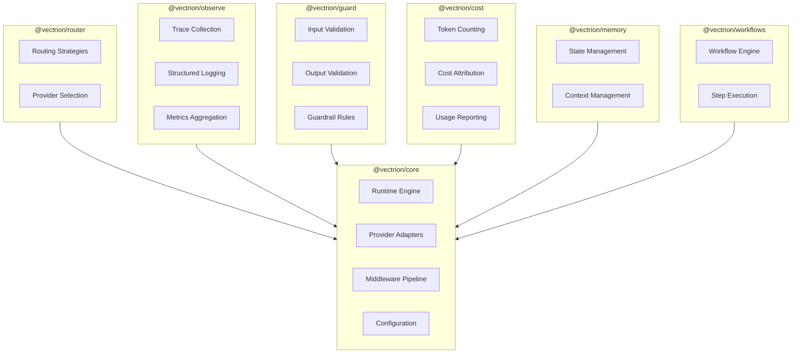

# D01 — Product Vision & Infrastructure Philosophy

| Field            | Value                                              |
| ---------------- | -------------------------------------------------- |
| **Document ID**  | D01                                                |
| **Title**        | Product Vision & Infrastructure Philosophy         |
| **Status**       | Draft                                              |
| **Priority**     | P0 — Foundation                                    |
| **Tier**         | Tier 0                                             |
| **Author**       | Lead Systems Architect                             |
| **Dependencies** | None (root document)                               |
| **Dependents**   | D02, D03, D22 (all Tier 1+ documents transitively) |
| **Created**      | 2026-05-28                                         |
| **Last Updated** | 2026-05-28                                         |

---

## Table of Contents

1. [Purpose](#1-purpose)
2. [Scope](#2-scope)
3. [Goals](#3-goals)
4. [Non-Goals](#4-non-goals)
5. [Industry Problem Analysis](#5-industry-problem-analysis)
6. [Existing Tooling Gap Analysis](#6-existing-tooling-gap-analysis)
7. [Why Vectrion Exists](#7-why-vectrion-exists)
8. [Infrastructure Philosophy](#8-infrastructure-philosophy)
9. [Architectural Principles](#9-architectural-principles)
10. [Design Philosophy](#10-design-philosophy)
11. [Developer Experience Goals](#11-developer-experience-goals)
12. [Scalability Direction](#12-scalability-direction)
13. [MVP Boundaries & Constraints](#13-mvp-boundaries--constraints)
14. [Long-Term Platform Vision](#14-long-term-platform-vision)
15. [Architectural Decisions Record](#15-architectural-decisions-record)
16. [Tradeoffs](#16-tradeoffs)
17. [Component Responsibility Overview](#17-component-responsibility-overview)
18. [Data Flow — Conceptual](#18-data-flow--conceptual)
19. [Extensibility Considerations](#19-extensibility-considerations)
20. [Performance Considerations](#20-performance-considerations)
21. [Failure Handling Philosophy](#21-failure-handling-philosophy)
22. [Future Scalability](#22-future-scalability)
23. [Example Usage — Conceptual](#23-example-usage--conceptual)
24. [Risks & Constraints](#24-risks--constraints)
25. [Open Questions](#25-open-questions)
26. [Implementation Notes](#26-implementation-notes)
27. [Future Expansion Possibilities](#27-future-expansion-possibilities)
28. [Glossary](#28-glossary)

---

## 1. Purpose

This document establishes the foundational vision, philosophy, and architectural reasoning for **Vectrion** — a modular, TypeScript-based runtime infrastructure SDK for AI applications.

Vectrion is not an application framework. It is not a prompt library. It is not a chatbot toolkit. Vectrion is **infrastructure**. It occupies the layer between application logic and AI provider APIs, managing the operational concerns that production AI systems must solve but that no individual application should re-implement.

This document answers three questions that every subsequent design document, RFC, and implementation decision must trace back to:

1. **What problem does Vectrion solve?** — The operational complexity of production AI systems.
2. **Why must Vectrion solve it?** — Because existing tooling conflates infrastructure with application logic, producing tightly-coupled, non-composable, vendor-locked systems.
3. **How does Vectrion's philosophy differ?** — By treating AI runtime management as a infrastructure concern with clean separation from application semantics.

Every document in the Vectrion documentation ecosystem is a descendant of this one. If a design decision in any downstream document cannot be traced back to a principle articulated here, that decision requires re-evaluation.

---

## 2. Scope

### In Scope

- Definition of the industry problem Vectrion addresses
- Analysis of gaps in existing AI development tooling
- Vectrion's infrastructure philosophy and first principles
- Architectural principles governing all design decisions
- Developer experience goals and ergonomic standards
- MVP scope boundaries and explicit constraints
- Long-term platform evolution trajectory
- Terminology standardization (glossary)

### Out of Scope

- Detailed system architecture (→ D02)
- Package boundary definitions (→ D03)
- Runtime lifecycle mechanics (→ D04)
- Specific subsystem designs (→ D05–D14)
- API surface specifications (→ D08)
- Implementation details, code samples, or TypeScript type signatures
- Deployment models, CI/CD, or release engineering

---

## 3. Goals

### Primary Goals

| #   | Goal                                                                    | Measurement                                                      |
| --- | ----------------------------------------------------------------------- | ---------------------------------------------------------------- |
| G1  | Establish a single source of truth for Vectrion's identity              | All downstream docs reference D01 principles                     |
| G2  | Define clear boundaries between infrastructure and application concerns | Provider-agnostic core; no application-specific logic in runtime |
| G3  | Create a philosophy that prevents architectural drift                   | Principles testable against every design decision                |
| G4  | Ensure the project has a credible long-term trajectory                  | Scalability section covers 3+ evolution phases                   |
| G5  | Attract infrastructure-minded contributors                              | Document tone and depth signals engineering maturity             |

### Secondary Goals

| #   | Goal                                             | Measurement                                                              |
| --- | ------------------------------------------------ | ------------------------------------------------------------------------ |
| G6  | Establish shared vocabulary across all documents | Glossary adopted in all subsequent docs                                  |
| G7  | Differentiate Vectrion from existing tools       | Gap analysis covers ≥5 competitors with specific architectural critiques |
| G8  | Define what Vectrion is NOT                      | Non-goals are explicit, falsifiable, and enforceable                     |

---

## 4. Non-Goals

The following are **explicitly not goals** of Vectrion. These boundaries are load-bearing. Removing any of them changes the nature of the project and must trigger a formal RFC.

| #   | Non-Goal                                                   | Rationale                                                                                                                                  |
| --- | ---------------------------------------------------------- | ------------------------------------------------------------------------------------------------------------------------------------------ |
| NG1 | Vectrion is NOT an application framework                   | It does not prescribe how to build chatbots, agents, or RAG pipelines. It provides runtime infrastructure that those applications consume. |
| NG2 | Vectrion is NOT a prompt engineering library               | It does not manage prompt templates, few-shot examples, or prompt optimization. Prompt content is application-level concern.               |
| NG3 | Vectrion is NOT a hosted service                           | The MVP runs entirely within the developer's process. There is no Vectrion cloud, no Vectrion API, no Vectrion dashboard as a service.     |
| NG4 | Vectrion is NOT a model training or fine-tuning platform   | It manages inference-time operational concerns only.                                                                                       |
| NG5 | Vectrion is NOT a vector database or embedding store       | Memory subsystem may integrate with vector stores but does not implement one.                                                              |
| NG6 | Vectrion does NOT enforce specific AI application patterns | It does not require agents, chains, graphs, or any particular orchestration model.                                                         |
| NG7 | Vectrion does NOT manage deployment infrastructure         | No Kubernetes operators, no Docker orchestration, no cloud resource provisioning.                                                          |
| NG8 | Vectrion does NOT compete with model providers             | It abstracts providers, it does not replace them.                                                                                          |

---

## 5. Industry Problem Analysis

### 5.1 The State of AI Application Development (2024–2026)

The AI application development landscape has undergone a fundamental shift. The primary bottleneck is no longer model capability — it is **operational complexity**. Building a proof-of-concept that calls an LLM API takes minutes. Building a production system that reliably, observably, and cost-effectively manages LLM interactions across providers, failure modes, and scaling demands takes months.

This operational complexity manifests across several dimensions:

#### 5.1.1 Provider Fragmentation

The inference provider ecosystem is fragmented and rapidly evolving:

- **Commercial API providers**: OpenAI, Anthropic, Google AI Studio, Cohere, Mistral, AI21
- **Inference platforms**: Together AI, Groq, Fireworks, Replicate, Anyscale
- **Aggregators**: OpenRouter, LiteLLM (proxy mode)
- **Local inference**: Ollama, llama.cpp, vLLM, TGI, LocalAI
- **Cloud-managed**: AWS Bedrock, Azure OpenAI, Google Vertex AI

Each provider has:

- Different API schemas (despite OpenAI-compatible trends, subtle incompatibilities persist)
- Different authentication mechanisms
- Different rate limiting behaviors
- Different error response formats
- Different streaming implementations
- Different token counting methodologies
- Different pricing models

**The result**: Applications that target a single provider are vendor-locked. Applications that target multiple providers implement bespoke adapter code that is fragile, untested, and inconsistent.

#### 5.1.2 Operational Concern Sprawl

Production AI systems must manage:

| Concern           | Description                                               | Typical Implementation                        |
| ----------------- | --------------------------------------------------------- | --------------------------------------------- |
| **Retry logic**   | Transient failures, rate limits, overloaded backends      | Ad-hoc `try/catch` with exponential backoff   |
| **Failover**      | Primary provider down, fallback to secondary              | Manual if/else chains                         |
| **Rate limiting** | Respect provider limits, implement client-side throttling | Per-provider bespoke logic                    |
| **Cost tracking** | Per-request token usage, cost attribution                 | Post-hoc log parsing                          |
| **Observability** | Latency tracking, error rates, token distributions        | Scattered `console.log` or manual integration |
| **Caching**       | Avoid redundant identical requests                        | Application-level memoization                 |
| **Validation**    | Input sanitization, output schema enforcement             | Manual Zod/Joi schemas per endpoint           |
| **Guardrails**    | Content filtering, PII detection, output constraints      | Third-party service calls                     |
| **Streaming**     | Token-by-token delivery, backpressure management          | Provider-specific stream handling             |

Every production team re-implements these concerns. The implementations are inconsistent, incomplete, and untested against edge cases. This is the classic "infrastructure problem" — operational concerns that are orthogonal to application logic but essential for production reliability.

#### 5.1.3 Coupling of Infrastructure and Application Logic

The most damaging pattern in current AI development is the **conflation of infrastructure concerns with application logic**. A typical codebase contains:

```
// Application concern: what to ask
const prompt = buildPrompt(userQuery, context);

// Infrastructure concern: how to ask it reliably
try {
  const response = await openai.chat.completions.create({
    model: "gpt-4",
    messages: [{ role: "user", content: prompt }],
  });

  // Infrastructure concern: track costs
  const tokens = response.usage?.total_tokens;
  await costTracker.record(tokens, "gpt-4");

  // Infrastructure concern: validate output
  const parsed = outputSchema.parse(response.choices[0].message.content);

  // Application concern: use the result
  return processResult(parsed);

} catch (error) {
  // Infrastructure concern: retry/failover
  if (isRateLimitError(error)) {
    await delay(calculateBackoff(retryCount));
    return retry();
  }
  if (isProviderDown(error)) {
    return fallbackToAnthropic(prompt);
  }
  throw error;
}
```

In this pattern — which is representative of **the vast majority of production AI code** — infrastructure concerns account for 70–80% of the code volume. The actual application logic (build prompt, process result) is buried beneath retry logic, cost tracking, validation, and error handling.

This coupling creates:

- **Fragility**: Changing providers requires touching application code
- **Inconsistency**: Each call site re-implements operational concerns differently
- **Untestability**: Infrastructure behavior is entangled with business logic
- **Unmaintainability**: Operational upgrades (new retry strategy, new provider) require shotgun surgery across the codebase

#### 5.1.4 The Missing Layer

Web development solved an analogous problem decades ago. The HTTP request lifecycle — routing, middleware, error handling, logging, authentication — is managed by infrastructure (Express, Koa, Hono, Fastify). Application developers write handlers; the framework manages operational concerns.

**AI application development has no equivalent layer.** There is no standardized, composable, middleware-driven runtime that manages the AI request lifecycle. Every application reinvents this layer, poorly.

This is the gap Vectrion fills.

---

## 6. Existing Tooling Gap Analysis

### 6.1 Methodology

The following analysis evaluates existing tools against five infrastructure criteria:

| Criterion                        | Definition                                                                              |
| -------------------------------- | --------------------------------------------------------------------------------------- |
| **Separation of Concerns**       | Does the tool cleanly separate infrastructure from application logic?                   |
| **Composability**                | Can capabilities be mixed, matched, and extended independently?                         |
| **Provider Abstraction Quality** | Is the abstraction deep enough to be truly provider-agnostic?                           |
| **Production Readiness**         | Does the tool address retry, failover, observability, and cost as first-class concerns? |
| **Extensibility**                | Can the tool be extended without forking or monkey-patching?                            |

### 6.2 LangChain / LangChain.js

**Category**: Application framework with infrastructure side-effects

**Architecture**: Chain/Graph-based orchestration with provider integrations

**Strengths**:

- Extensive provider coverage
- Large ecosystem of integrations
- Active community

**Infrastructure Gaps**:

| Gap                           | Detail                                                                                                                                                                                    |
| ----------------------------- | ----------------------------------------------------------------------------------------------------------------------------------------------------------------------------------------- |
| **Tight coupling**            | Chains, agents, and tools conflate orchestration patterns with infrastructure concerns. Retry logic is embedded in chain execution, not in a separable middleware layer.                  |
| **Abstraction leakage**       | Provider-specific behaviors leak through the abstraction. `ChatOpenAI` and `ChatAnthropic` expose different configuration surfaces despite theoretically implementing the same interface. |
| **Non-composable middleware** | Callbacks exist but are observer-only. There is no middleware pipeline that can intercept, transform, retry, or reroute requests.                                                         |
| **Monolithic package**        | Despite recent modularization efforts, the dependency graph remains deep. Installing `@langchain/core` pulls substantial transitive dependencies.                                         |
| **Opinionated orchestration** | LangChain prescribes chains, agents, and graphs as the orchestration model. Applications that don't fit this model must fight the framework.                                              |

**Assessment**: LangChain is an **application framework**, not infrastructure. It solves "how do I build an AI application" but not "how do I reliably operate AI inference in production."

### 6.3 Vercel AI SDK

**Category**: Frontend-oriented AI integration SDK

**Architecture**: React-hooks-driven with streaming-first design

**Strengths**:

- Excellent DX for Next.js/React applications
- Clean streaming abstractions
- Good provider interface design (`ai` core package)

**Infrastructure Gaps**:

| Gap                              | Detail                                                                                                                        |
| -------------------------------- | ----------------------------------------------------------------------------------------------------------------------------- |
| **Frontend-coupled**             | Core value proposition is tied to React hooks (`useChat`, `useCompletion`). Server-side usage is secondary.                   |
| **Limited operational concerns** | No built-in retry/failover engine. No cost tracking. No middleware pipeline. Observability requires external integration.     |
| **Narrow scope**                 | Designed for request-response AI interactions in web applications. Not intended as general-purpose AI runtime infrastructure. |
| **No routing engine**            | No concept of model routing, load balancing, or provider failover at the SDK level.                                           |

**Assessment**: Vercel AI SDK is an excellent **integration library** for frontend applications. It is not runtime infrastructure. It solves "how do I stream AI responses to a React component" but not "how do I manage AI inference as an operational concern."

### 6.4 LiteLLM

**Category**: Provider proxy / abstraction layer

**Architecture**: Python-first proxy server with OpenAI-compatible interface

**Strengths**:

- Broadest provider coverage in the ecosystem
- OpenAI-compatible proxy simplifies migration
- Good cost tracking and rate limiting

**Infrastructure Gaps**:

| Gap                          | Detail                                                                                                                                 |
| ---------------------------- | -------------------------------------------------------------------------------------------------------------------------------------- |
| **Python-first**             | TypeScript support is secondary. JS/TS developers must run a Python proxy server or use limited SDK wrappers.                          |
| **Proxy architecture**       | Requires a running proxy server for full functionality. This adds deployment complexity, latency, and a failure point.                 |
| **No composable middleware** | Request processing is configured via parameters, not a composable pipeline. Custom behavior requires forking or writing proxy plugins. |
| **Monolithic**               | All functionality is in a single package. You cannot adopt cost tracking without adopting the full proxy.                              |

**Assessment**: LiteLLM is the closest to infrastructure thinking but is **architecturally misaligned** for TypeScript-first, library-mode usage. Running a Python proxy server contradicts local-first, zero-dependency philosophy.

### 6.5 Portkey / Helicone

**Category**: Hosted AI gateway / observability platform

**Architecture**: Cloud proxy with dashboard

**Strengths**:

- Production-grade observability
- Cost tracking and analytics
- Rate limiting and caching at the gateway level

**Infrastructure Gaps**:

| Gap                            | Detail                                                                                                                                          |
| ------------------------------ | ----------------------------------------------------------------------------------------------------------------------------------------------- |
| **Hosted dependency**          | Requires routing traffic through a third-party service. This adds latency, creates a single point of failure, and raises data privacy concerns. |
| **Not embeddable**             | Cannot be used as an in-process library. The value proposition requires the hosted gateway.                                                     |
| **Vendor lock-in**             | Switching from Portkey/Helicone requires re-implementing all operational concerns they manage.                                                  |
| **No local development story** | Local development either requires the hosted service or loses all operational capabilities.                                                     |

**Assessment**: AI gateways solve real problems but create **infrastructure dependencies** that contradict local-first, self-contained operation. They are the right solution for enterprises with ops teams, not for SDK developers who need embedded infrastructure.

### 6.6 Gap Summary Matrix

| Capability               | LangChain    | Vercel AI  | LiteLLM    | Portkey   | **Vectrion** |
| ------------------------ | ------------ | ---------- | ---------- | --------- | ------------ |
| Separation of concerns   | ⚠️ Partial   | ⚠️ Partial | ⚠️ Partial | ✅        | ✅ Target    |
| Composable middleware    | ❌           | ❌         | ❌         | ❌        | ✅ Target    |
| Provider abstraction     | ⚠️ Leaky     | ✅ Good    | ✅ Good    | ✅        | ✅ Target    |
| Retry/Failover engine    | ⚠️ Basic     | ❌         | ⚠️ Basic   | ✅        | ✅ Target    |
| Cost tracking            | ❌           | ❌         | ✅         | ✅        | ✅ Target    |
| Observability pipeline   | ⚠️ Callbacks | ❌         | ⚠️ Logging | ✅        | ✅ Target    |
| TypeScript-native        | ⚠️ Port      | ✅         | ❌ Python  | ⚠️ SDK    | ✅ Target    |
| Library-mode (no server) | ✅           | ✅         | ❌ Proxy   | ❌ Hosted | ✅ Target    |
| Modular packages         | ⚠️ Partial   | ⚠️ Partial | ❌         | ❌        | ✅ Target    |
| Routing engine           | ❌           | ❌         | ⚠️ Basic   | ✅        | ✅ Target    |
| Schema validation        | ⚠️ Manual    | ⚠️ Zod     | ❌         | ❌        | ✅ Target    |
| Plugin system            | ⚠️ Partial   | ❌         | ❌         | ❌        | ✅ Target    |
| Zero hosted dependencies | ✅           | ✅         | ❌         | ❌        | ✅ Target    |

### 6.7 The Architectural Void

No existing tool provides:

1. A **TypeScript-native**, **library-mode** runtime layer
2. With a **composable middleware pipeline** (not just callbacks)
3. That manages **all operational concerns** (retry, failover, routing, observability, cost, validation)
4. Through **modular, independently adoptable packages**
5. With **zero hosted dependencies**
6. And **clean separation** between infrastructure and application logic

This is the void Vectrion fills.

---

## 7. Why Vectrion Exists

### 7.1 Thesis Statement

> **Vectrion exists because AI application development has an infrastructure problem, not an application problem.** The operational concerns of production AI systems — provider abstraction, retry logic, failover, routing, observability, cost tracking, validation, and middleware — are infrastructure concerns that belong in a dedicated runtime layer, not scattered across application code.

### 7.2 The Infrastructure Analogy

Consider the evolution of web application development:

| Era         | State                                                                                    | Solution                        |
| ----------- | ---------------------------------------------------------------------------------------- | ------------------------------- |
| Early 2000s | Every application hand-rolled HTTP parsing, routing, middleware, sessions                | Express.js, Rails, Django       |
| 2010s       | Every application hand-rolled container orchestration, service discovery, load balancing | Kubernetes, Consul, Envoy       |
| 2020s       | Every application hand-rolled observability, tracing, metrics                            | OpenTelemetry, Datadog, Grafana |

AI application development in 2024–2026 is at the **"early 2000s of web development"** stage. Every application hand-rolls its AI operational infrastructure. The patterns are repeated thousands of times, inconsistently, incompletely.

Vectrion is the **Express.js moment for AI runtime management**. It does not tell you what to build. It manages how your AI interactions operate in production.

### 7.3 Core Value Proposition

Vectrion provides value across three dimensions:

#### Dimension 1: Operational Reliability

Without Vectrion:

- Retry logic is ad-hoc and inconsistent
- Failover is manual and untested
- Rate limiting is reactive (crash, then fix)
- Errors are swallowed or poorly categorized

With Vectrion:

- Retry strategies are configurable, composable, and provider-aware
- Failover cascades are declarative and automatically tested
- Rate limiting is proactive with client-side token bucket algorithms
- Errors are normalized, categorized, and actionable

#### Dimension 2: Operational Visibility

Without Vectrion:

- Token usage is estimated or unknown
- Cost attribution is impossible across teams/features
- Latency tracking is absent or manual
- Request tracing requires custom instrumentation

With Vectrion:

- Token usage is tracked per-request with provider-specific accuracy
- Cost is attributed per-request, per-model, per-provider
- Latency is measured at each pipeline stage (middleware, provider, total)
- Every request has a trace ID with full lifecycle visibility

#### Dimension 3: Architectural Cleanliness

Without Vectrion:

- Infrastructure code is tangled with application logic
- Changing providers requires application code changes
- Testing AI interactions requires mocking provider APIs
- Adding operational capabilities requires modifying every call site

With Vectrion:

- Application code contains only application logic
- Provider changes are configuration changes
- Testing uses Vectrion's provider abstraction for deterministic mocking
- Operational capabilities are added via middleware, not code changes

### 7.4 Who Is Vectrion For?

**Primary audience**: TypeScript/JavaScript developers building production AI applications who need operational infrastructure without hosted dependencies.

**Personas**:

| Persona                                               | Needs                                                      | Vectrion Value                                               |
| ----------------------------------------------------- | ---------------------------------------------------------- | ------------------------------------------------------------ |
| **Solo developer** building AI-powered SaaS           | Reliability, cost awareness, provider flexibility          | Pre-built operational infrastructure with zero ops overhead  |
| **Startup team** scaling from prototype to production | Observability, failover, consistent provider abstraction   | Production readiness without dedicated infrastructure team   |
| **Platform team** at a mid-size company               | Standardized AI runtime layer across multiple applications | Shared infrastructure SDK with middleware extensibility      |
| **Open-source library author** building AI tools      | Provider-agnostic foundation, clean abstractions           | Infrastructure layer they can build upon without reinventing |

**Explicitly NOT for**:

- Teams that need hosted AI gateway services (→ Portkey, Helicone)
- Python-first teams (→ LiteLLM, LangChain Python)
- Teams building AI model training infrastructure
- Teams that only use a single provider with no operational requirements

---

## 8. Infrastructure Philosophy

Vectrion's design is governed by a set of infrastructure-level principles. These are not aspirational — they are **constraints** that must be satisfied by every design decision in every downstream document.

### 8.1 Principle: Infrastructure, Not Framework

Vectrion is infrastructure. The distinction matters:

|                          | Framework                        | Infrastructure                                          |
| ------------------------ | -------------------------------- | ------------------------------------------------------- |
| **Controls**             | Application flow                 | Operational concerns                                    |
| **Prescribes**           | How to build applications        | How operations execute reliably                         |
| **Developer writes**     | Code inside framework boundaries | Code that consumes infrastructure APIs                  |
| **Inversion of control** | Framework calls your code        | Your code calls infrastructure                          |
| **Coupling**             | Application coupled to framework | Application loosely coupled to infrastructure interface |

Vectrion does not use inversion of control. It does not manage application lifecycle. It does not prescribe orchestration patterns. It provides **services** — routing, retry, observability, validation — that application code consumes through clean interfaces.

### 8.2 Principle: Separation of Operational Concerns

Every operational concern in Vectrion must be:

1. **Independently adoptable**: A developer can use cost tracking without using routing. A developer can use middleware without using observability.
2. **Independently testable**: Each concern has its own test surface and can be verified in isolation.
3. **Independently replaceable**: A developer can replace Vectrion's retry logic with their own while keeping everything else.
4. **Independently configurable**: Each concern has its own configuration surface that does not bleed into other concerns.

This principle maps directly to the monorepo package structure:

```
packages/
  core/     → Runtime engine, provider abstraction, middleware pipeline
  router/   → Model routing and selection strategies
  observe/  → Tracing, logging, metrics collection
  guard/    → Input/output validation, guardrails
  cost/     → Token counting, cost attribution
  memory/   → Conversational state management
  workflows/→ Multi-step orchestration
```

Each package is a **boundary of concern**. Cross-package dependencies must flow downward (toward `core`), never laterally or upward.

### 8.3 Principle: Local-First, Zero-Cost MVP Infrastructure

The MVP infrastructure must run entirely within the developer's process:

- **No external services required**: No databases, no message queues, no monitoring backends
- **No network dependencies for infrastructure**: Provider API calls are the only network dependencies
- **No paid services**: Observability, tracing, and cost tracking work with local storage
- **No deployment requirements**: `npm install @vectrion/core` is the entire setup

This does not mean Vectrion cannot integrate with external services. It means external services are **optional upgrades**, never requirements.

**Architectural implication**: Every subsystem must have a **local-first default implementation** and an **interface** that allows plugging in external backends. Example:

- Tracing: defaults to local JSON file storage, can be configured to export to Jaeger/OTLP
- Cost tracking: defaults to in-memory aggregation, can be configured to export to analytics backends
- Memory: defaults to in-memory store, can be configured to use Redis or a vector database

### 8.4 Principle: Middleware-Driven Pipeline Architecture

Vectrion's core execution model is a **middleware pipeline**, inspired by Koa/Hono middleware patterns but adapted for AI request lifecycles.

Every AI request flows through a composable pipeline:

```
Request → [Middleware₁] → [Middleware₂] → ... → [Provider Adapter] → Response
              ↑                                        |
              └────────── Response flows back ─────────┘
```

Middleware can:

- **Intercept** requests before they reach the provider
- **Transform** requests (add metadata, modify parameters)
- **Short-circuit** the pipeline (return cached responses, block invalid requests)
- **Observe** requests and responses (logging, metrics, tracing)
- **Retry** failed requests with modified parameters
- **Reroute** requests to different providers

This architecture means:

- Retry logic is middleware, not embedded in the provider adapter
- Cost tracking is middleware, not a manual post-processing step
- Validation is middleware, not a manual pre-processing step
- Caching is middleware, not an application-level concern

### 8.5 Principle: Type Safety as Infrastructure Guarantee

TypeScript's type system is not decoration — it is **infrastructure**. Vectrion leverages the type system to provide compile-time guarantees about:

- **Provider configuration**: Invalid provider configurations are caught at compile time
- **Middleware composition**: Middleware type signatures ensure pipeline compatibility
- **Request/Response contracts**: The type system enforces that requests match provider expectations
- **Plugin interfaces**: Plugin contracts are statically verified

This principle has concrete implications:

- Generic type parameters are used extensively for provider-specific type narrowing
- Discriminated unions model the full space of runtime states
- Template literal types enforce string-format constraints where applicable
- Conditional types enable provider-aware API surfaces

### 8.6 Principle: Composability Over Configuration

Vectrion prefers **composable building blocks** over **configuration objects**.

**Configuration approach** (rejected as primary pattern):

```typescript
// Anti-pattern: monolithic configuration
const client = new Vectrion({
    retry: { maxRetries: 3, backoff: 'exponential' },
    fallback: { providers: ['openai', 'anthropic'] },
    logging: { level: 'debug', output: 'file' },
    validation: { input: schema, output: schema },
    cache: { ttl: 300, backend: 'memory' },
});
```

**Composable approach** (preferred pattern):

```typescript
// Pattern: composable middleware pipeline
const client = createVectrion({
    provider: googleAI({ apiKey }),
    middleware: [
        retry({ maxAttempts: 3, backoff: exponential() }),
        fallback({ providers: [ollamaProvider(), googleAIProvider()] }),
        trace({ sink: localFile('./traces') }),
        validate({ output: responseSchema }),
        trackCost({ attribution: 'search-feature' }),
    ],
});
```

The composable approach is superior because:

- Each middleware is independently testable
- Middleware order is explicit and meaningful
- New capabilities are added by composing new middleware, not extending configuration schemas
- Third-party middleware integrates through the same interface as built-in middleware

### 8.7 Principle: Progressive Complexity

Vectrion's API surface must support **progressive complexity**:

**Level 1 — Minimal** (< 5 lines to first API call):

```typescript
const v = createVectrion({ provider: googleAI({ apiKey }) });
const result = await v.generate('Hello, world');
```

**Level 2 — Operational** (add production concerns incrementally):

```typescript
const v = createVectrion({
    provider: googleAI({ apiKey }),
    middleware: [retry(), trace(), trackCost()],
});
```

**Level 3 — Advanced** (full infrastructure control):

```typescript
const v = createVectrion({
    router: weightedRouter([
        { provider: googleAI({ apiKey }), weight: 0.7 },
        { provider: ollama({ model: 'llama3' }), weight: 0.3 },
    ]),
    middleware: [
        rateLimiter({ tokensPerMinute: 10000 }),
        retry({ maxAttempts: 3, backoff: exponential({ base: 1000 }) }),
        fallback({ cascade: [googleAI(), ollama()] }),
        trace({ sink: otlpExporter({ endpoint: '...' }) }),
        validate({ input: inputSchema, output: outputSchema }),
        trackCost({ sink: analyticsExporter() }),
        cache({ backend: redis({ url: '...' }), ttl: 300 }),
    ],
});
```

Each level is a strict superset of the previous. No level requires understanding concepts from a higher level.

---

## 9. Architectural Principles

These principles govern the structural decisions of the system. They are more concrete than philosophy and more general than specific design choices.

### 9.1 Single Responsibility Packages

Each package in the monorepo has exactly **one responsibility boundary**:

| Package     | Responsibility                                            | NOT Responsible For                                     |
| ----------- | --------------------------------------------------------- | ------------------------------------------------------- |
| `core`      | Runtime engine, provider abstraction, middleware pipeline | Routing logic, observability backends, validation rules |
| `router`    | Model selection strategies, provider routing              | Request execution, provider communication               |
| `observe`   | Trace collection, log aggregation, metrics                | Request execution, data storage backends                |
| `guard`     | Input/output validation, content guardrails               | Request execution, schema definition                    |
| `cost`      | Token counting, cost attribution, usage reporting         | Request execution, billing                              |
| `memory`    | Conversational state, context management                  | Request execution, storage backends                     |
| `workflows` | Multi-step orchestration, DAG execution                   | Individual step execution, provider management          |

### 9.2 Dependency Direction

Dependencies flow **inward toward `core`**. No package depends on a sibling package.

```
                    ┌──────────┐
                    │   core   │  ← Every package depends on core
                    └──────────┘
                         ▲
          ┌──────────────┼──────────────┐
          │              │              │
    ┌──────────┐  ┌──────────┐  ┌──────────┐
    │  router  │  │ observe  │  │  guard   │
    └──────────┘  └──────────┘  └──────────┘
    ┌──────────┐  ┌──────────┐  ┌──────────┐
    │   cost   │  │  memory  │  │workflows │
    └──────────┘  └──────────┘  └──────────┘
```

**Rule**: If `packages/router` needs functionality from `packages/observe`, that functionality must be extracted into `packages/core` or exposed through a shared interface in `core`.

**Rationale**: Lateral dependencies create circular dependency risks, complicate build ordering, and make packages non-independently adoptable.

### 9.3 Interface-Driven Design

Every major boundary in Vectrion is defined by a **TypeScript interface**, not a concrete implementation.

- Provider adapters implement `ProviderAdapter`
- Middleware functions implement `Middleware`
- Routing strategies implement `RoutingStrategy`
- Trace sinks implement `TraceSink`
- Cache backends implement `CacheBackend`
- Memory stores implement `MemoryStore`

This enables:

- Multiple implementations of each interface (built-in + third-party)
- Testing via mock implementations
- Future expansion without breaking changes
- Clear contract documentation

### 9.4 Fail-Open with Degradation

Infrastructure failures in Vectrion must not crash the application. The failure hierarchy is:

1. **Middleware failure**: Log the error, skip the middleware, continue the pipeline
2. **Provider failure**: Trigger retry/failover logic per configuration
3. **Routing failure**: Fall back to the default provider
4. **Observability failure**: Drop the trace/metric, do not block the request
5. **Validation failure**: Return a typed error, do not throw uncaught exceptions

**Principle**: A broken trace sink should never prevent an AI request from completing. A broken cost tracker should never block a response. Infrastructure failures degrade gracefully; they never cascade into application failures.

### 9.5 Deterministic Testability

Every component in Vectrion must be **deterministically testable** without network calls:

- Provider adapters accept injected HTTP clients for mocking
- Middleware pipelines can be executed with synthetic requests
- Routing strategies can be tested with mock provider metadata
- Time-dependent logic (retries, rate limiting) accepts injected clock functions
- Random-dependent logic (jitter) accepts injected random functions

---

## 10. Design Philosophy

### 10.1 Documentation-First Development

Vectrion follows **documentation-first development**. This means:

1. Every subsystem is fully documented before implementation begins
2. Documentation defines the interface contract; implementation satisfies it
3. Design documents are living artifacts that evolve with the system
4. Documentation is not an afterthought — it is the primary engineering artifact

**Rationale**: In infrastructure projects, the interface is more important than the implementation. Users depend on documented behavior. Undocumented behavior is a bug, even if it works.

### 10.2 Explicit Over Implicit

Vectrion prefers explicit configuration over implicit behavior:

- No "magic" auto-detection of providers
- No implicit middleware injection
- No hidden retry logic
- No automatic cost tracking that developers don't know about

Everything Vectrion does is visible in the configuration. If it's not in the configuration, it's not happening.

### 10.3 Errors as Values, Not Exceptions

Vectrion uses a **Result-type pattern** for error handling in its public API:

```typescript
type VectrionResult<T> =
    | { success: true; data: T; metadata: RequestMetadata }
    | { success: false; error: VectrionError; metadata: RequestMetadata };
```

**Rationale**: Exceptions are invisible in TypeScript's type system. A function that throws provides no compile-time indication of failure modes. Result types make failure explicit, typed, and exhaustively handleable.

Exceptions are still used for **programmer errors** (invalid configuration, type violations) — these indicate bugs, not runtime conditions.

### 10.4 Zero Runtime Dependencies (Core)

`@vectrion/core` has **zero runtime dependencies**. No lodash, no axios, no winston.

**Rationale**:

- Dependency supply chain is a security risk
- Dependencies create version conflicts with consumer applications
- Dependencies increase bundle size
- Core infrastructure should depend only on the language runtime

Subsystem packages (`observe`, `guard`, etc.) may have minimal, carefully chosen dependencies where reimplementation would be unjustifiable (e.g., Zod for schema validation in `guard`).

---

## 11. Developer Experience Goals

### 11.1 Time to First API Call: < 2 Minutes

A developer with `node` and `npm` installed should go from zero to a working AI API call in under two minutes:

```bash
npm install @vectrion/core
```

```typescript
import { createVectrion, googleAI } from '@vectrion/core';

const v = createVectrion({ provider: googleAI({ apiKey: '...' }) });
const result = await v.generate('Explain middleware patterns');
console.log(result.data);
```

### 11.2 Error Messages as Documentation

Every error Vectrion produces must include:

1. **What** went wrong (clear, specific description)
2. **Why** it went wrong (the condition that triggered the error)
3. **How** to fix it (actionable remediation steps)
4. **Where** to learn more (link to relevant documentation)

```
VectrionError: Provider "google-ai" returned HTTP 429 (Rate Limited)

  ▸ Your request exceeded the provider's rate limit.
  ▸ Current retry configuration: { maxAttempts: 1 }
  ▸ To add automatic retry with backoff:

    middleware: [retry({ maxAttempts: 3, backoff: exponential() })]

  ▸ Documentation: https://vectrion.dev/docs/middleware/retry
```

### 11.3 IntelliSense-Driven API Design

Every public API surface must provide rich IntelliSense experience:

- JSDoc comments on every exported function, type, and interface
- Parameter descriptions with examples
- Return type documentation
- `@example` tags with copy-pasteable code
- `@see` tags linking to related APIs
- Discriminated union types that narrow correctly in IDE autocompletion

### 11.4 Progressive Type Safety

The API supports both loose and strict typing:

```typescript
// Loose: quick prototyping
const result = await v.generate('Hello');

// Strict: production usage with full type narrowing
const result = await v.generate<MyOutputSchema>('Hello', {
    output: mySchema,
    model: 'gemini-2.0-flash',
});
// result.data is typed as MyOutputSchema
```

---

## 12. Scalability Direction

Vectrion's architecture is designed for three evolution phases. The MVP implements Phase 1 only, but architectural decisions in Phase 1 must not preclude Phases 2 and 3.

### Phase 1: Embedded Library (MVP)

```
┌─────────────────────────────────────────────┐
│              Application Process             │
│                                              │
│  ┌──────────────────────────────────────┐   │
│  │          Vectrion Runtime             │   │
│  │  ┌────────┐ ┌────────┐ ┌────────┐   │   │
│  │  │Middleware│ │Provider│ │Observer│   │   │
│  │  │Pipeline │ │Adapter │ │  Sink  │   │   │
│  │  └────────┘ └────────┘ └────────┘   │   │
│  └──────────────────────────────────────┘   │
│                                              │
│  Application Code                            │
└─────────────────────────────────────────────┘
```

- Runs in-process within the developer's application
- All storage is local (files, in-memory)
- No network dependencies except provider API calls
- Single-tenant, single-application

### Phase 2: Shared Runtime (Post-MVP)

```
┌──────────────────────────────────────────────────┐
│              Vectrion Standalone Runtime           │
│  ┌────────┐ ┌────────┐ ┌────────┐ ┌────────┐   │
│  │  Core  │ │ Router │ │Observe │ │ Guard  │   │
│  └────────┘ └────────┘ └────────┘ └────────┘   │
└──────────────────────────────────────────────────┘
        ▲               ▲               ▲
        │               │               │
   ┌────────┐     ┌────────┐     ┌────────┐
   │ App 1  │     │ App 2  │     │ App 3  │
   └────────┘     └────────┘     └────────┘
```

- Vectrion runs as a standalone process (sidecar or local service)
- Multiple applications share a single runtime instance
- Centralized observability and cost tracking
- Still local-first, no cloud dependency

### Phase 3: Platform Mode (Long-Term)

```
┌──────────────────────────────────────────────────────────┐
│                  Vectrion Platform                        │
│  ┌──────────┐  ┌──────────┐  ┌──────────┐              │
│  │ Runtime  │  │ Runtime  │  │ Runtime  │   ...         │
│  │ Node 1   │  │ Node 2   │  │ Node 3   │              │
│  └──────────┘  └──────────┘  └──────────┘              │
│       ▲              ▲              ▲                    │
│       └──────────────┼──────────────┘                    │
│              ┌───────────────┐                           │
│              │  Control Plane │                          │
│              └───────────────┘                           │
└──────────────────────────────────────────────────────────┘
```

- Distributed runtime with control plane
- Multi-tenant, multi-application
- Cloud-native deployment options
- Enterprise features (RBAC, audit logging, compliance)

**Critical constraint**: Phase 1 interfaces must not preclude Phase 2/3 implementations. This means:

- All storage backends are behind interfaces (not hardcoded to local file)
- All communication is through typed messages (not direct function calls that can't be serialized)
- All configuration is declarative (not imperative setup that requires process co-location)

---

## 13. MVP Boundaries & Constraints

### 13.1 What the MVP Includes

| Component               | MVP Scope                                                           | Explicitly Excluded                                      |
| ----------------------- | ------------------------------------------------------------------- | -------------------------------------------------------- |
| **Core Runtime**        | Request lifecycle, middleware pipeline, provider abstraction        | Distributed execution, multi-tenant isolation            |
| **Provider Adapters**   | Google AI Studio, Ollama                                            | OpenAI, Anthropic, Groq (future)                         |
| **Middleware Pipeline** | Composable middleware with `next()` pattern, built-in retry/logging | Distributed middleware, cross-process middleware         |
| **Retry Engine**        | Exponential backoff, configurable max attempts, jitter              | Circuit breaker patterns, adaptive retry                 |
| **Failover**            | Ordered provider cascade                                            | Health-check-based routing, weighted failover            |
| **Router**              | Static strategy routing (round-robin, priority, random)             | ML-based routing, cost-optimized routing                 |
| **Observability**       | Structured logging, local trace storage (JSON files)                | OTLP export, distributed tracing, metrics aggregation    |
| **Token Tracking**      | Per-request token counts, per-model cost estimation                 | Real-time cost dashboards, budget enforcement            |
| **Validation**          | Zod-based output schema validation                                  | Content classification, PII detection, custom guardrails |
| **Local Storage**       | File-based trace storage, in-memory caching                         | Redis, PostgreSQL, vector databases                      |
| **TypeScript API**      | Full public API with comprehensive types                            | Code generation, CLI tools                               |

### 13.2 What the MVP Excludes

The following are **explicitly deferred** and must not influence MVP architecture decisions except through interface design:

- Memory / conversational state management
- Workflow / multi-step orchestration
- Plugin system implementation (interfaces designed, not runtime)
- Semantic caching (embedding-based deduplication)
- Real-time streaming middleware (basic streaming supported, not middleware-interceptable)
- Dashboard or UI components
- CLI tooling
- Code generation or scaffolding tools

### 13.3 MVP Success Criteria

The MVP is successful when:

1. A developer can `npm install @vectrion/core` and make an AI API call in < 2 minutes
2. Switching between Google AI Studio and Ollama requires only changing the provider configuration
3. Adding retry logic requires adding one middleware, not modifying application code
4. Every request produces a traceable log entry with token usage and latency
5. The public API has 100% JSDoc coverage
6. The test suite covers > 90% of core runtime paths
7. Zero runtime dependencies in `@vectrion/core`

---

## 14. Long-Term Platform Vision

### 14.1 The Vectrion Ecosystem (24-Month Vision)

```
┌─────────────────────────────────────────────────────────────────────┐
│                        Vectrion Ecosystem                           │
│                                                                     │
│  ┌───────────────────────────────────────────────────────────────┐  │
│  │                    Core SDK Packages                          │  │
│  │  core │ router │ observe │ guard │ cost │ memory │ workflows  │  │
│  └───────────────────────────────────────────────────────────────┘  │
│                              ▲                                      │
│  ┌───────────────────────────┼───────────────────────────────────┐  │
│  │                   Integration Layer                           │  │
│  │  @vectrion/openai    │ @vectrion/anthropic │ @vectrion/groq   │  │
│  │  @vectrion/together  │ @vectrion/openrouter │ @vectrion/aws   │  │
│  └───────────────────────────────────────────────────────────────┘  │
│                              ▲                                      │
│  ┌───────────────────────────┼───────────────────────────────────┐  │
│  │                   Developer Tools                             │  │
│  │  @vectrion/cli │ @vectrion/devtools │ @vectrion/playground    │  │
│  └───────────────────────────────────────────────────────────────┘  │
│                              ▲                                      │
│  ┌───────────────────────────┼───────────────────────────────────┐  │
│  │                  Community Ecosystem                          │  │
│  │  Third-party middleware │ Custom providers │ Plugin packages   │  │
│  └───────────────────────────────────────────────────────────────┘  │
└─────────────────────────────────────────────────────────────────────┘
```

### 14.2 Platform Evolution Milestones

| Milestone              | Timeline    | Deliverables                                                                               |
| ---------------------- | ----------- | ------------------------------------------------------------------------------------------ |
| **v0.1** — Foundation  | Month 1–2   | Core runtime, Google AI Studio + Ollama adapters, middleware pipeline, basic observability |
| **v0.2** — Operational | Month 3–4   | Router engine, retry/failover, cost tracking, validation, local trace storage              |
| **v0.3** — Ecosystem   | Month 5–6   | OpenAI + Anthropic adapters, plugin system, memory system, CLI tools                       |
| **v0.4** — Production  | Month 7–9   | Workflow orchestration, semantic caching, OTLP export, performance optimization            |
| **v1.0** — Stable      | Month 10–12 | API stability guarantee, comprehensive documentation site, playground application          |
| **v1.x** — Platform    | Month 12–18 | Standalone runtime mode, shared runtime, enterprise features                               |
| **v2.0** — Distributed | Month 18–24 | Distributed runtime, control plane, multi-tenant, cloud-native deployment                  |

---

## 15. Architectural Decisions Record

This section captures major architectural decisions that have already been made at the vision level. Each decision will be referenced by its ADR number in downstream documents.

### ADR-001: TypeScript as Primary Language

**Decision**: Vectrion is implemented in TypeScript.

**Context**: The target audience is TypeScript/JavaScript developers. The AI application ecosystem is increasingly TypeScript-first (Vercel AI SDK, LangChain.js, OpenAI Node SDK).

**Alternatives considered**:

- **Rust with WASM + JS bindings**: Superior performance, but dramatically higher contribution barrier and ecosystem friction.
- **Go with gRPC + JS client**: Good for standalone runtime, but poor for library-mode usage.

**Tradeoffs**:

- ✅ Direct ecosystem alignment with target audience
- ✅ Rich type system for infrastructure guarantees
- ✅ Single language for SDK + tooling + documentation
- ⚠️ Performance ceiling lower than Rust/Go for compute-heavy operations
- ⚠️ Single-threaded runtime limits CPU-bound middleware

**Status**: Accepted. Non-negotiable for MVP.

### ADR-002: Monorepo with Independent Packages

**Decision**: Vectrion is organized as a monorepo with independently publishable packages.

**Context**: Modularity is a core principle. Developers must be able to adopt individual capabilities without the full SDK.

**Alternatives considered**:

- **Single package**: Simpler build, but violates modularity principle and forces developers to install unused capabilities.
- **Multi-repo**: Maximum independence, but dramatically increases maintenance overhead, cross-cutting changes, and version coordination.

**Tradeoffs**:

- ✅ Independent adoption of capabilities
- ✅ Clear boundary enforcement
- ✅ Independent versioning and release
- ⚠️ Monorepo tooling complexity (build ordering, workspace management)
- ⚠️ Cross-package refactoring requires coordination

**Status**: Accepted.

### ADR-003: Middleware Pipeline as Core Execution Model

**Decision**: The core execution model is a middleware pipeline, not a plugin registry or event system.

**Context**: Middleware pipelines (Koa, Hono) provide composable, ordered, bidirectional request/response processing. This model naturally supports retry, validation, caching, and observability as middleware concerns.

**Alternatives considered**:

- **Event emitter pattern**: Decoupled, but lacks ordering guarantees and bidirectional flow. Observers can't modify requests.
- **Plugin registry with hooks**: Flexible, but hook-based systems tend toward implicit coupling and unclear execution order.
- **Decorator pattern**: Type-safe wrapping, but composition is awkward and debugging wrapped stacks is difficult.

**Tradeoffs**:

- ✅ Composable, ordered, bidirectional
- ✅ Well-understood pattern in the JS ecosystem
- ✅ Each middleware is independently testable
- ⚠️ Deep pipelines add latency (mitigated: AI API call latency dominates)
- ⚠️ Error propagation through middleware stack requires careful design

**Status**: Accepted.

### ADR-004: Result Types Over Exceptions for Public API

**Decision**: Public API methods return `Result<T, E>` types instead of throwing exceptions.

**Context**: TypeScript exceptions are untyped and invisible in function signatures. Infrastructure code must make failure modes explicit.

**Alternatives considered**:

- **Throw exceptions**: Familiar pattern, but forces `try/catch` at every call site and provides no compile-time indication of failure modes.
- **Tuple returns `[error, data]`**: Go-style, but awkward in TypeScript without destructuring discipline.

**Tradeoffs**:

- ✅ Failure modes visible in type signatures
- ✅ Exhaustive error handling enabled by discriminated unions
- ✅ Metadata (tokens, latency) always available, even on failure
- ⚠️ Unfamiliar pattern for some TypeScript developers
- ⚠️ Slightly more verbose call-site code

**Status**: Accepted.

### ADR-005: Zero Runtime Dependencies for Core

**Decision**: `@vectrion/core` has zero runtime dependencies.

**Context**: Core infrastructure should minimize supply chain risk and bundle size impact.

**Alternatives considered**:

- **Allow curated dependencies**: Faster development, but every dependency is a potential security vulnerability and version conflict.

**Tradeoffs**:

- ✅ Minimal supply chain attack surface
- ✅ No version conflicts with consumer applications
- ✅ Minimal bundle size
- ⚠️ Must reimplement some utilities (deep merge, retry scheduling)
- ⚠️ Slower initial development

**Status**: Accepted.

---

## 16. Tradeoffs

### 16.1 Active Tradeoffs

| Tradeoff                           | Choice           | Cost                                   | Benefit                                                  |
| ---------------------------------- | ---------------- | -------------------------------------- | -------------------------------------------------------- |
| TypeScript vs lower-level language | TypeScript       | Performance ceiling                    | Ecosystem alignment, DX, contribution accessibility      |
| Middleware vs event system         | Middleware       | Ordering constraints, pipeline latency | Composability, bidirectional flow, clear execution model |
| Result types vs exceptions         | Result types     | Call-site verbosity                    | Type-safe error handling, metadata on failure            |
| Zero deps vs curated deps          | Zero deps (core) | Reimplementation cost                  | Supply chain safety, no version conflicts                |
| Monorepo vs multi-repo             | Monorepo         | Tooling complexity                     | Coordinated development, shared infrastructure           |
| Local-first vs cloud-first         | Local-first      | No managed observability OOB           | Zero setup cost, no vendor dependency, privacy           |
| Composable APIs vs config objects  | Composable       | Slightly more code                     | Testability, extensibility, explicit ordering            |

### 16.2 Deferred Tradeoffs

These will be resolved in downstream documents:

| Tradeoff                          | Decision Document | Options                                         |
| --------------------------------- | ----------------- | ----------------------------------------------- |
| Streaming middleware interception | D06               | Full interception vs observe-only for streams   |
| Router strategy extensibility     | D07               | Interface-based vs class-based extension        |
| Trace format                      | D09               | Custom schema vs OpenTelemetry-compatible spans |
| Validation engine                 | D10               | Zod-only vs pluggable validators                |
| Memory backend interface          | D12               | Key-value vs vector-native interface            |
| Workflow execution model          | D13               | DAG vs sequential vs state machine              |

---

## 17. Component Responsibility Overview

This section provides a high-level responsibility map. Detailed designs are in respective documents (D04–D14).



---

## 18. Data Flow — Conceptual

A single AI request through Vectrion follows this conceptual data flow:

```
Developer Code
      │
      ▼
┌─────────────────┐
│ v.generate()    │  ← SDK entry point
└────────┬────────┘
         │
         ▼
┌─────────────────┐
│  Configuration  │  ← Resolve provider, middleware stack, router
│   Resolution    │
└────────┬────────┘
         │
         ▼
┌─────────────────┐
│   Middleware     │  ← Pre-processing: validation, rate limiting,
│   Pipeline (→)  │     cost estimation, cache check, tracing start
└────────┬────────┘
         │
         ▼
┌─────────────────┐
│   Router        │  ← Select provider based on routing strategy
│   (if configured)│
└────────┬────────┘
         │
         ▼
┌─────────────────┐
│   Provider      │  ← Transform to provider-specific API format,
│   Adapter       │     execute HTTP request, transform response
└────────┬────────┘
         │
         ▼
┌─────────────────┐
│   Middleware     │  ← Post-processing: validation, cost tracking,
│   Pipeline (←)  │     tracing end, response transformation
└────────┬────────┘
         │
         ▼
┌─────────────────┐
│  Result<T>      │  ← Typed result with data + metadata
└─────────────────┘
```

### Request Metadata Accumulation

Throughout the pipeline, a `RequestMetadata` object accumulates:

```typescript
interface RequestMetadata {
    requestId: string; // Unique per-request identifier
    traceId: string; // Trace correlation ID
    provider: string; // Which provider handled the request
    model: string; // Which model was used
    latency: {
        total: number; // End-to-end latency (ms)
        provider: number; // Provider API call latency (ms)
        middleware: number; // Total middleware processing time (ms)
    };
    tokens: {
        input: number;
        output: number;
        total: number;
    };
    cost: {
        estimated: number; // Estimated cost in USD
        currency: 'USD';
    };
    retries: number; // Number of retry attempts
    cached: boolean; // Whether the response was served from cache
    middlewareTimings: Record<string, number>; // Per-middleware latency
}
```

This metadata is **always available**, even on failure. This is a direct consequence of ADR-004 (Result types over exceptions).

---

## 19. Extensibility Considerations

### 19.1 Extension Points

Vectrion provides five primary extension points:

| Extension Point               | Mechanism                                 | Example                                            |
| ----------------------------- | ----------------------------------------- | -------------------------------------------------- |
| **Custom Providers**          | Implement `ProviderAdapter` interface     | Add support for a new AI API                       |
| **Custom Middleware**         | Implement `Middleware` function signature | Add custom logging, authentication, rate limiting  |
| **Custom Routing Strategies** | Implement `RoutingStrategy` interface     | Cost-optimized routing, latency-based routing      |
| **Custom Trace Sinks**        | Implement `TraceSink` interface           | Export traces to custom observability backend      |
| **Custom Validators**         | Implement `Validator` interface           | Custom content filters, domain-specific validation |

### 19.2 Extension Design Rules

1. **Extensions use the same interface as built-in components**: There is no distinction between a "built-in" provider adapter and a "custom" one. They implement the same interface.
2. **Extensions are registered, not injected**: Extensions are passed through configuration, not discovered via service locators or DI containers.
3. **Extensions are independently packageable**: A custom provider adapter can be published as its own npm package.
4. **Extensions do not require Vectrion source modification**: No forking, no monkey-patching, no private API access.

---

## 20. Performance Considerations

### 20.1 Latency Budget

AI API calls typically take 200ms–5000ms. Vectrion's overhead must be negligible in comparison:

| Component                        | Latency Budget | Justification                                |
| -------------------------------- | -------------- | -------------------------------------------- |
| Middleware pipeline (total)      | < 5ms          | Pipeline is synchronous function composition |
| Provider adapter (serialization) | < 2ms          | JSON serialization is fast                   |
| Router decision                  | < 1ms          | Strategy evaluation is O(n) over providers   |
| Configuration resolution         | < 1ms          | Cached after first resolution                |
| **Total Vectrion overhead**      | **< 10ms**     | < 2% of a typical 500ms API call             |

### 20.2 Memory Budget

Vectrion must not significantly increase application memory footprint:

| Component                        | Memory Budget              | Justification                                            |
| -------------------------------- | -------------------------- | -------------------------------------------------------- |
| Core runtime instance            | < 5MB                      | Configuration, middleware references, provider instances |
| Per-request overhead             | < 50KB                     | Request context, metadata accumulation                   |
| Trace storage (in-memory buffer) | Configurable, default 10MB | Circular buffer, flushed to disk periodically            |

### 20.3 Bundle Size Budget

For applications that bundle Vectrion (browser-adjacent scenarios):

| Package                 | Bundle Size Budget (minified + gzipped) |
| ----------------------- | --------------------------------------- |
| `@vectrion/core`        | < 15KB                                  |
| Each additional package | < 10KB                                  |
| Total SDK               | < 50KB                                  |

---

## 21. Failure Handling Philosophy

### 21.1 Error Taxonomy

Vectrion categorizes errors into four classes:

| Class                    | Description                       | Example                                | Handling                                         |
| ------------------------ | --------------------------------- | -------------------------------------- | ------------------------------------------------ |
| **Configuration Error**  | Invalid setup                     | Missing API key, invalid middleware    | Thrown at initialization, not at request time    |
| **Provider Error**       | AI provider failure               | Rate limit, timeout, invalid response  | Retried/failed over per middleware configuration |
| **Validation Error**     | Input/output constraint violation | Output doesn't match schema            | Returned as typed error in Result                |
| **Infrastructure Error** | Vectrion internal failure         | Trace sink crash, middleware exception | Logged, gracefully degraded, request continues   |

### 21.2 Error Normalization

Provider-specific errors are normalized into a consistent `VectrionError` type:

```typescript
interface VectrionError {
    code: ErrorCode; // Discriminated union of error codes
    message: string; // Human-readable description
    provider?: string; // Which provider generated the error
    statusCode?: number; // HTTP status code, if applicable
    retryable: boolean; // Whether the error is retryable
    retryAfter?: number; // Suggested retry delay (ms), if available
    cause?: Error; // Original error for debugging
}

type ErrorCode =
    | 'RATE_LIMITED'
    | 'PROVIDER_UNAVAILABLE'
    | 'AUTHENTICATION_FAILED'
    | 'MODEL_NOT_FOUND'
    | 'CONTEXT_LENGTH_EXCEEDED'
    | 'CONTENT_FILTERED'
    | 'INVALID_REQUEST'
    | 'VALIDATION_FAILED'
    | 'TIMEOUT'
    | 'UNKNOWN';
```

This normalization means application code handles `RATE_LIMITED` the same way regardless of whether it came from Google AI Studio, Ollama, or any future provider.

---

## 22. Future Scalability

> Detailed in D23. This section provides the vision-level trajectory.

### 22.1 Scaling Dimensions

| Dimension               | MVP                  | Phase 2                  | Phase 3                   |
| ----------------------- | -------------------- | ------------------------ | ------------------------- |
| **Deployment**          | In-process library   | Standalone sidecar       | Distributed cluster       |
| **Tenancy**             | Single application   | Multi-application        | Multi-tenant              |
| **Storage**             | Local files + memory | Shared local storage     | Distributed storage       |
| **Observability**       | Local traces         | Centralized local traces | Distributed tracing       |
| **Configuration**       | Programmatic         | Programmatic + file      | Programmatic + file + API |
| **Provider management** | Static               | Dynamic discovery        | Fleet management          |

### 22.2 Architecture Invariants Across Phases

These must hold true from MVP through Phase 3:

1. **Interface stability**: Public interfaces defined in Phase 1 must remain valid in Phase 3
2. **Backward compatibility**: Phase 1 configuration must work unchanged in Phase 2/3
3. **Progressive adoption**: Each phase is opt-in; applications can remain at any phase
4. **No forced migration**: Moving from Phase 1 to Phase 2 does not require rewriting application code

---

## 23. Example Usage — Conceptual

These examples illustrate the **target developer experience**, not final API syntax. API surface is defined in D08.

### 23.1 Minimal Usage

```typescript
import { createVectrion, googleAI } from '@vectrion/core';

const v = createVectrion({
    provider: googleAI({ apiKey: process.env.GOOGLE_AI_KEY }),
});

const result = await v.generate('What is middleware?');

if (result.success) {
    console.log(result.data);
    console.log(`Tokens used: ${result.metadata.tokens.total}`);
} else {
    console.error(`Error: ${result.error.code} — ${result.error.message}`);
}
```

### 23.2 Production Usage

```typescript
import { createVectrion, googleAI, ollama } from '@vectrion/core';
import { retry, fallback } from '@vectrion/core/middleware';
import { trace } from '@vectrion/observe';
import { validate } from '@vectrion/guard';
import { trackCost } from '@vectrion/cost';
import { z } from 'zod';

const ResponseSchema = z.object({
    answer: z.string(),
    confidence: z.number().min(0).max(1),
    sources: z.array(z.string()),
});

const v = createVectrion({
    provider: googleAI({
        apiKey: process.env.GOOGLE_AI_KEY,
        model: 'gemini-2.0-flash',
    }),
    middleware: [
        trace({ sink: localFile('./traces') }),
        retry({ maxAttempts: 3, backoff: exponential({ base: 1000 }) }),
        fallback({ providers: [ollama({ model: 'llama3' })] }),
        validate({ output: ResponseSchema }),
        trackCost({ attribution: 'qa-pipeline' }),
    ],
});

const result = await v.generate('Explain the CAP theorem', {
    output: ResponseSchema,
});

if (result.success) {
    // result.data is typed as { answer: string; confidence: number; sources: string[] }
    console.log(result.data.answer);
    console.log(`Cost: $${result.metadata.cost.estimated}`);
    console.log(`Latency: ${result.metadata.latency.total}ms`);
} else {
    // result.error is typed as VectrionError
    console.error(`Failed: ${result.error.code}`);
    // Metadata is still available on failure
    console.log(`Retries attempted: ${result.metadata.retries}`);
}
```

### 23.3 Multi-Provider Routing

```typescript
import { createVectrion, googleAI, ollama } from '@vectrion/core';
import { priorityRouter } from '@vectrion/router';

const v = createVectrion({
    router: priorityRouter([
        { provider: googleAI({ apiKey, model: 'gemini-2.0-flash' }), priority: 1 },
        { provider: ollama({ model: 'llama3' }), priority: 2 },
    ]),
    middleware: [retry({ maxAttempts: 2 }), trace(), trackCost()],
});

// Router selects the highest-priority available provider
const result = await v.generate('Summarize this document');
```

---

## 24. Risks & Constraints

### 24.1 Technical Risks

| Risk                                         | Severity | Mitigation                                                                                                                                   |
| -------------------------------------------- | -------- | -------------------------------------------------------------------------------------------------------------------------------------------- |
| **Provider API instability**                 | High     | Adapter pattern isolates breaking changes. Semantic versioning per adapter.                                                                  |
| **Type system limitations**                  | Medium   | Some provider-specific behaviors may not be fully expressible in TypeScript's type system. Accept pragmatic `as` casts in adapter internals. |
| **Streaming middleware complexity**          | High     | Streaming middleware interception is architecturally complex. MVP may support observe-only streaming middleware.                             |
| **Performance overhead at scale**            | Low      | Middleware pipeline is synchronous function composition. AI API latency dominates by orders of magnitude.                                    |
| **Scope creep toward application framework** | High     | Non-goals (NG1–NG8) are load-bearing constraints. Every feature request must be evaluated against them.                                      |

### 24.2 Project Risks

| Risk                                | Severity | Mitigation                                                                          |
| ----------------------------------- | -------- | ----------------------------------------------------------------------------------- |
| **Documentation drift**             | Medium   | Documentation-first process. Code PRs require documentation updates.                |
| **Ecosystem competition**           | High     | Differentiate on architecture (infrastructure vs framework), not features.          |
| **Contributor onboarding friction** | Medium   | Clear package boundaries, comprehensive contribution guidelines, good first issues. |
| **Single-maintainer bus factor**    | High     | Open governance model, documented architecture, minimal "magic" in codebase.        |

### 24.3 Constraints

| Constraint                   | Impact                | Rationale                                                            |
| ---------------------------- | --------------------- | -------------------------------------------------------------------- |
| **Node.js >= 18**            | Limits to modern Node | Requires `fetch` API, `crypto.randomUUID`, and modern stream support |
| **ESM-only**                 | No CommonJS support   | ESM is the standard. Dual publishing adds maintenance overhead.      |
| **Zero runtime deps (core)** | Reimplementation cost | Supply chain security and minimal footprint                          |
| **Local-first MVP**          | No hosted features    | Reduces complexity, eliminates infrastructure dependencies           |

---

## 25. Open Questions

These questions are tracked here and will be resolved in the indicated downstream documents:

| #   | Question                                                                   | Resolving Document | Impact                             |
| --- | -------------------------------------------------------------------------- | ------------------ | ---------------------------------- |
| OQ1 | Should streaming middleware support full interception or observe-only?     | D06                | Middleware architecture complexity |
| OQ2 | Should the router support dynamic provider discovery or static-only?       | D07                | Router engine complexity           |
| OQ3 | Should cost tracking support custom pricing tables or API-sourced pricing? | D11                | Cost system architecture           |
| OQ4 | Should memory system be MVP or post-MVP?                                   | D12                | MVP scope                          |
| OQ5 | Should the plugin system be designed in MVP but implemented post-MVP?      | D14                | MVP scope                          |
| OQ6 | What monorepo tooling (Turborepo, Nx, pnpm workspaces)?                    | D03, D17           | Build architecture                 |
| OQ7 | What test framework (Vitest, Jest)?                                        | D16                | Testing infrastructure             |
| OQ8 | ESM-only or dual CJS/ESM?                                                  | D17                | Build complexity                   |
| OQ9 | Target TypeScript version (5.4+, 5.5+)?                                    | D08                | API surface expressiveness         |

---

## 26. Implementation Notes

### 26.1 Documentation → Implementation Flow

```
D01 (this doc) → defines WHY
  └→ D02 → defines WHAT components exist
    └→ D04 → defines HOW the runtime executes
      └→ Implementation of packages/core
        └→ D05 → defines HOW providers integrate
          └→ Implementation of provider adapters
```

### 26.2 Code Must Trace to Documentation

Every exported function, type, and interface in the codebase must trace to a requirement in a design document. If a code construct exists without a corresponding design document entry, either:

1. The code is speculative and should be removed, or
2. The design document is incomplete and should be updated.

### 26.3 Naming Conventions (Established Here, Enforced Everywhere)

| Concept               | Convention                        | Example                                |
| --------------------- | --------------------------------- | -------------------------------------- |
| Package names         | `@vectrion/<name>`                | `@vectrion/core`                       |
| Factory functions     | `create<Thing>`                   | `createVectrion`, `createRouter`       |
| Middleware            | `<verb>()` returning `Middleware` | `retry()`, `trace()`, `validate()`     |
| Provider factories    | `<providerName>()`                | `googleAI()`, `ollama()`               |
| Interfaces            | `PascalCase`, no `I` prefix       | `ProviderAdapter`, `Middleware`        |
| Error codes           | `SCREAMING_SNAKE_CASE`            | `RATE_LIMITED`, `PROVIDER_UNAVAILABLE` |
| Configuration objects | `<Thing>Config`                   | `RetryConfig`, `RouterConfig`          |
| Result types          | `VectrionResult<T>`               | —                                      |

---

## 27. Future Expansion Possibilities

These are **explicitly not planned** but are architecturally anticipated. The MVP design must not preclude them.

| Possibility                           | Architecture Impact                                  | Enabling Decision                                              |
| ------------------------------------- | ---------------------------------------------------- | -------------------------------------------------------------- |
| **Browser runtime**                   | Core must avoid Node-specific APIs                   | Use `fetch` not `http`, `crypto.randomUUID` not `uuid` package |
| **Edge runtime (Cloudflare Workers)** | No filesystem access                                 | Storage backends behind interfaces                             |
| **Multi-language SDKs**               | Core concepts must be language-agnostic              | Interface-driven design, serializable configuration            |
| **Real-time streaming analytics**     | Observe pipeline must support streaming              | Trace sink interface supports streaming                        |
| **A/B testing of models**             | Router must support experiment assignment            | Routing strategy interface is generic enough                   |
| **Cost budgeting and enforcement**    | Cost system must support real-time budget checks     | Cost tracking middleware has access to cumulative state        |
| **Multi-modal support**               | Provider adapter interface must not assume text-only | Generic message types, not string-only                         |

---

## 28. Glossary

Standardized terminology for use across all Vectrion documentation.

| Term                       | Definition                                                                                              |
| -------------------------- | ------------------------------------------------------------------------------------------------------- |
| **Provider**               | An external AI inference service (Google AI Studio, Ollama, OpenAI, etc.)                               |
| **Provider Adapter**       | A Vectrion component that translates between Vectrion's unified API and a specific provider's API       |
| **Middleware**             | A composable function that intercepts, transforms, or observes requests and responses in the pipeline   |
| **Pipeline**               | The ordered sequence of middleware that processes a request before and after provider execution         |
| **Router**                 | The component that selects which provider and model should handle a given request                       |
| **Routing Strategy**       | An algorithm that determines provider selection (priority, round-robin, weighted, etc.)                 |
| **Trace**                  | A complete record of a single request's lifecycle through the pipeline                                  |
| **Trace Sink**             | A destination for trace data (local file, OTLP endpoint, custom backend)                                |
| **Guardrail**              | A validation rule that constrains input or output content                                               |
| **Result Type**            | A discriminated union representing either success (with data) or failure (with typed error)             |
| **Request Metadata**       | Accumulated operational data about a request (tokens, cost, latency, retries)                           |
| **Runtime**                | The Vectrion engine that manages the request lifecycle, middleware pipeline, and provider communication |
| **SDK**                    | Software Development Kit — the set of packages developers install and use                               |
| **Infrastructure**         | Operational concerns (retry, failover, observability) that are orthogonal to application logic          |
| **Local-first**            | Design principle: full functionality without external service dependencies                              |
| **Zero-cost MVP**          | Design principle: no paid services required for basic operation                                         |
| **Progressive complexity** | API design pattern: simple default usage, with incremental complexity as needs grow                     |
| **Fail-open**              | Failure handling strategy: infrastructure failures degrade capabilities but do not block requests       |

---

## Document Revision History

| Version | Date       | Author                 | Changes       |
| ------- | ---------- | ---------------------- | ------------- |
| 0.1     | 2026-05-28 | Lead Systems Architect | Initial draft |

---

## Cross-References

| Document                  | Relationship                                                                       |
| ------------------------- | ---------------------------------------------------------------------------------- |
| D02 — System Architecture | Direct dependent. Derives component definitions from principles here.              |
| D03 — Monorepo Structure  | Direct dependent. Package structure derives from separation of concerns principle. |
| D08 — SDK API Surface     | Derives naming conventions, result type patterns, and DX goals from this document. |
| D22 — OSS Governance      | Derives governance philosophy from project vision.                                 |
| D24 — Roadmap             | Derives milestone structure from platform evolution vision.                        |

---

_This document is the root of the Vectrion documentation tree. All downstream documents must maintain consistency with the principles, philosophy, and constraints established here. Any proposed deviation from this document requires a formal RFC with explicit justification._
