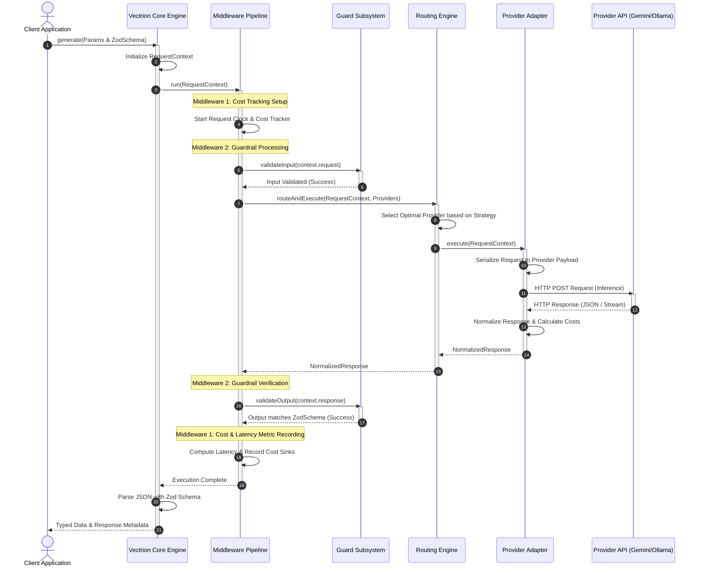

# D02 — System Architecture Overview

| Field            | Value                                                                                                                                         |
| ---------------- | --------------------------------------------------------------------------------------------------------------------------------------------- |
| **Document ID**  | D02                                                                                                                                           |
| **Title**        | System Architecture Overview                                                                                                                  |
| **Status**       | Draft                                                                                                                                         |
| **Priority**     | P0 — Foundation                                                                                                                               |
| **Tier**         | Tier 1                                                                                                                                        |
| **Author**       | Lead Systems Architect                                                                                                                        |
| **Dependencies** | [D01 — Product Vision & Infrastructure Philosophy](file:///Users/adijain/Documents/Projects/vectrion/docs/architecture/D01-product-vision.md) |
| **Dependents**   | D03, D04, D05, D06, D07, D08 (and all Tier 2+ documents)                                                                                      |
| **Created**      | 2026-05-28                                                                                                                                    |
| **Last Updated** | 2026-05-28                                                                                                                                    |

---

## Table of Contents

1. [Purpose](#1-purpose)
2. [Scope](#2-scope)
3. [Subsystem Decomposition](#3-subsystem-decomposition)
4. [High-Level Architecture Diagram](#4-high-level-architecture-diagram)
5. [Execution Lifecycle Flow](#5-execution-lifecycle-flow)
6. [Data & Context Model](#6-data--context-model)
7. [Interface Contracts & Abstraction Layers](#7-interface-contracts--abstraction-layers)
8. [Cross-Cutting Concerns](#8-cross-cutting-concerns)
9. [System Quality Attributes](#9-system-quality-attributes)
10. [Architectural Tradeoffs](#10-architectural-tradeoffs)
11. [Glossary](#11-glossary)

---

## 1. Purpose

This document provides the high-level system architecture specification for **Vectrion** — the modular, TypeScript-based runtime infrastructure SDK for AI applications. It serves as the primary system-level blueprint, mapping functional boundaries, component relationships, data flow patterns, and architectural abstractions across the entire monorepo.

All subsequent Tier 2+ specifications (including package boundaries, runtime lifecycle, specific subsystem designs, and API surfaces) must trace their structural designs back to this system overview.

---

## 2. Scope

### In Scope

- Subsystem decomposition and core architectural boundaries
- Physical package and runtime boundary separation
- Component topology and interactive sequence flows
- High-level data representation and request/response context mapping
- Architectural tradeoffs and quality attribute assessments

### Out of Scope

- Monorepo physical structural configuration details (→ D03)
- Step-by-step state transition mechanics of the middleware runtime (→ D04)
- Direct schema specifications and network/protocol schemas for individual model providers (→ D05)
- Code-level implementations of specific middleware engines (→ D06)

---

## 3. Subsystem Decomposition

Vectrion is decomposed into seven decoupled subsystems, each representing a single responsibility boundary. These subsystems are distributed across discrete packages in the monorepo, communicating via strictly defined, compiled TypeScript interfaces.

```
+-------------------------------------------------------------------------+
|                                  CLIENT                                 |
|                         (Vectrion Client Engine)                        |
+------------------------------------+------------------------------------+
                                     |
                                     v
+------------------------------------+------------------------------------+
|                         MIDDLEWARE PIPELINE                            |
|             (Runner, Cache, Retries, Fallbacks, Metrics)                |
+------------------------------------+------------------------------------+
                                     |
                                     v
+-----------------+                  |                  +-----------------+
|   OBSERVE       | <----------------+----------------> |   GUARD         |
|   SUBSYSTEM     |                                     |   SUBSYSTEM     |
|   (OTLP/Traces) |                                     |   (Schema/PII)  |
+-----------------+                                     +-----------------+
                                     |
                                     v
+------------------------------------+------------------------------------+
|                           ROUTING ENGINE                                |
|                 (Dynamic Cost, Latency & Load Balancing)                |
+------------------------------------+------------------------------------+
                                     |
                        +------------+------------+
                        |                         |
                        v                         v
           +------------+------------+ +----------+------------+
           |    PROVIDER ADAPTER     | |    PROVIDER ADAPTER     |
           |      (Google AI)        | |       (Ollama)          |
           +-------------------------+ +-------------------------+
```

### 3.1 Core Engine Subsystem

The central orchestrator of the request-response lifecycle. It is thin, lightweight, and runtime-agnostic.

- **Responsibilities**: Initializes configurations, registers provider adapters, builds context states, and drives execution through the middleware chain and routing engine.
- **Boundary**: Stored under `packages/core`. Dependencies flow only toward shared types and utility packages.

### 3.2 Provider Adapter Subsystem

The normalization layer that maps diverse, vendor-specific API footprints to a uniform, standard format.

- **Responsibilities**: Normalizes request configurations (prompts, temperature, max tokens, schema), performs request serialization, handles network protocol execution (REST, Server-Sent Events streaming), maps HTTP headers/error codes, and parses token counts and cost structures.
- **Boundary**: Separated into individual packages (e.g., `packages/provider-google`, `packages/provider-ollama`).

### 3.3 Middleware Subsystem

The intercepts and intercept-transform pipelines executing around the provider call lifecycle.

- **Responsibilities**: Sequentially runs registration-based handlers. Implements retry limits, backoff strategies, in-process and distributed caches, and hooks into observability pipelines.
- **Boundary**: Registered inside `core` and extended via custom plugins.

### 3.4 Routing & Selection Subsystem

The engine that determines _how_ and _where_ a request is dispatched when multiple candidate provider adapters are available.

- **Responsibilities**: Matches model requests to capable adapters, implements fallback pipelines, and executes cost/latency-based routing optimizations.
- **Boundary**: Housed in `packages/router`.

### 3.5 Guardrails & Validation Subsystem

Ensures that all input parameters and output results satisfy the syntactic and semantic requirements of the application.

- **Responsibilities**: Enforces TypeScript/Zod schema validations, sanitizes inputs, and runs real-time post-processing text parsing.
- **Boundary**: Located in `packages/guard`.

### 3.6 Observability Subsystem

Collects instrumentation metrics, distributed traces, and structural application logs across the execution pipeline.

- **Responsibilities**: Populates detailed request spans, metrics (latency, tokens, costs), and outputs standardized OTLP/JSON structures.
- **Boundary**: Stored in `packages/observe`.

### 3.7 Shared Types & Utilities

The compile-time standard definitions that guarantee integration compatibility across all packages.

- **Responsibilities**: Declares core types (`RequestContext`, `NormalizedResponse`, `TokenUsage`, `ModelCost`).
- **Boundary**: Distributed in `packages/types` and `packages/shared`.

---

## 4. High-Level Architecture Diagram

The diagram below details the interaction sequence when a client initiates a structured request through the Vectrion SDK:



---

## 5. Execution Lifecycle Flow

The Vectrion request-response lifecycle comprises six distinct execution phases:

### Phase 1: Client Invocation & Initialization

The consumer calls `client.generate(...)` passing structural prompts, runtime limits, and validation parameters. Core engine constructs the mutable `RequestContext` state, defining unique trace IDs and timestamp references.

### Phase 2: Pre-Execution Middleware Traversal

The request context enters the **Onion-model middleware pipeline**. Pre-execution middleware handlers execute sequentially from outer to inner. Handlers may:

- Short-circuit the loop by returning cached responses.
- Enforce client-side rate-limits or request rate throttling.
- Intercept and modify request headers, metadata, or prompts.

### Phase 3: Route Selection & Failover Execution

The `RouterEngine` determines which provider adapter must receive the payload.

- It parses candidate adapters matching the requested model capabilities.
- It evaluates routing rules (e.g., `cheapest`, `balanced`).
- If an adapter fails, the router catches the exception and executes a configured cascade fallback sequence.

### Phase 4: Provider Dispatch & Serialization

The selected `ProviderAdapter` accepts the request context:

- It maps the normalized parameters to vendor-specific REST/SSE payloads.
- It dispatches the network call with the `AbortSignal` attached.
- Upon retrieval, it translates provider-specific token usages, calculates costs, and structures the response into `NormalizedResponse`.

### Phase 5: Post-Execution Middleware Traversal

As control yields back through the middleware pipeline (inner to outer):

- Output validation middleware runs validation checks against response texts.
- Metrics middleware computes elapsed durations and increments usage metrics.
- Caching middleware stores successful results in memory or Redis backends.

### Phase 6: Core Validation & Structuring

The core engine intercepts control, parses structured outputs if schemas are present, and returns a safe typed result to the user.

---

## 6. Data & Context Model

A single mutable data object, `RequestContext`, tracks the exact operational state throughout the entire execution pipeline.

```typescript
export interface RequestContext {
    // Configured inputs passed from client
    request: {
        model: string;
        prompt: string;
        temperature?: number;
        maxTokens?: number;
        schema?: z.ZodTypeAny;
    };

    // Populated after provider adapter execution
    response?: NormalizedResponse;

    // Aggregated operational metrics calculated during execution
    metrics?: {
        latencyMs: number;
        promptTokens: number;
        completionTokens: number;
        unitCostUsd: number;
    };

    // Custom metadata bucket for middleware communication
    metadata: Record<string, any>;
}
```

### Response Normalization Model

The adapter guarantees that all downstream consumers receive a standardized output structure:

```typescript
export interface NormalizedResponse {
    id: string; // Unique request ID generated by provider/client
    text: string; // The primary response text content
    model: string; // The exact model version executing the request
    provider: string; // The provider identifier (e.g. google-ai, ollama)
    usage: TokenUsage; // Normalized token statistics
    cost: ModelCost; // Standardized USD pricing calculation
    latencyMs: number; // Elapsed execution duration at adapter level
    rawResponse: unknown; // Full, unmodified response payload from provider
}
```

---

## 7. Interface Contracts & Abstraction Layers

Vectrion enforces strict operational decoupled contracts. Custom routers, custom provider adapters, and custom middleware pipelines can be written by implementing three core interfaces:

### 7.1 ProviderAdapter Interface

Adapters isolate vendor differences. Adding a new provider requires no core modifications:

```typescript
export interface ProviderAdapter {
    readonly providerId: string;
    readonly capabilities: Record<string, ProviderCapabilities>;

    initialize(): Promise<void>;
    execute(ctx: RequestContext, options?: { signal?: AbortSignal }): Promise<NormalizedResponse>;
}
```

### 7.2 RouterEngine Interface

Prescribes how routing selection and fallback mechanisms operate:

```typescript
export interface RouterEngine {
    routeAndExecute(
        ctx: RequestContext,
        providers: Map<string, ProviderAdapter>,
        options?: { signal?: AbortSignal },
    ): Promise<NormalizedResponse>;
}
```

### 7.3 Middleware Type Definition

Follows the standard Hono/Koa async next-pattern:

```typescript
export type NextFunction = () => Promise<void>;
export type Middleware = (ctx: RequestContext, next: NextFunction) => Promise<void>;
```

---

## 8. Cross-Cutting Concerns

### 8.1 Unified Error Normalization

All failures in Vectrion are wrapped in typed classes derived from `VectrionError`. The SDK guarantees that unexpected provider errors (e.g. HTTP 429, 500, JSON serialization issues) are parsed, classified, and returned without crashing host processes.

```
                  +----------------------+
                  |    VectrionError     |  (Root Error Class)
                  +----------+-----------+
                             |
         +-------------------+-------------------+
         |                                       |
+--------v--------------+               +--------v--------------+
| VectrionRouterError   |               |VectrionValidationError|
+-----------------------+               +-----------------------+
| Handles routing/      |               | Handles input/output  |
| fallback exhaustion   |               | Zod validation errors |
+-----------------------+               +-----------------------+
```

### 8.2 Memory Leak Prevention

By maintaining a strictly stateless model execution path, memory consumption is minimized. All state parameters reside within ephemeral stack frames or within the `RequestContext` scope, ensuring garbage collection immediately follows response resolution.

### 8.3 Context Propagation & Abort Signals

All network activities and middleware sequences actively pass down standard Web `AbortSignal` references. Consumers can abort execution at any time, instantly cancelling network requests, halting retry logic, and freeing runtime resources.

---

## 9. System Quality Attributes

| Quality Attribute | Architectural Design Choice                             | Impact                                                                              |
| ----------------- | ------------------------------------------------------- | ----------------------------------------------------------------------------------- |
| **Modularity**    | Mono-repo package separation via `pnpm` workspaces      | Clean dependency boundaries. Developers only install what they adopt.               |
| **Performance**   | Zero external-server requirements; zero-dependency core | Under 1ms routing and execution overhead. Minimal memory footprint.                 |
| **Reliability**   | onion-model middleware + router fallback cascaders      | High availability. Faulty providers degrade gracefully.                             |
| **Type Safety**   | Pervasive strict TypeScript compiler configurations     | Eliminates dynamic typing runtime crashes. Structured outputs are statically typed. |

---

## 10. Architectural Tradeoffs

### 10.1 In-Process SDK vs. Standalone Gateway Proxy

- **Decision**: Vectrion is designed as a direct in-process TypeScript library, not a separate gateway container (like LiteLLM proxy).
- **Tradeoff**: In-process execution removes network latency hops, simplifies local deployment, and eliminates single points of operational failure. However, cross-language support (e.g. Python, Go clients) is restricted.

### 10.2 Strict Schema Validation vs. Unconstrained Streams

- **Decision**: Schema validations parse full structured results before yielding data to consumers.
- **Tradeoff**: Guarantees database-ready inputs and safe execution states. However, it requires waiting for the complete generation cycle, precluding partial token validations.

---

## 11. Glossary

- **Core Engine**: The primary orchestrator handling configuration and middleware execution.
- **Provider Adapter**: The translation layer mapping request formats to specific AI vendors.
- **Onion Model**: A middleware pipeline execution design where handlers run sequentially, delegate to the next item, and yield execution backwards.
- **Short-Circuit**: Early termination of request execution (e.g., by returning cached hits) before reaching remote APIs.
- **Structured Output**: AI generations forced into structured, JSON schemas validated against programmatic types.
