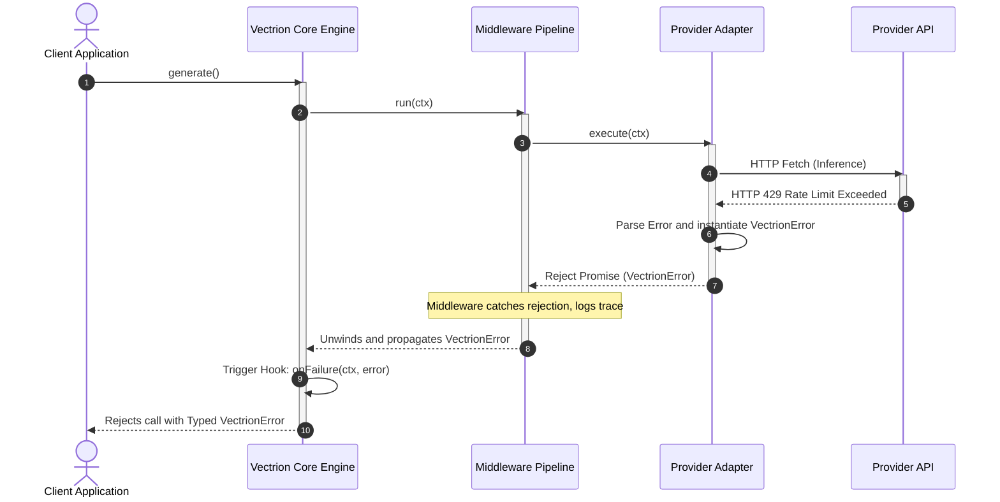

# D04 — Runtime Lifecycle Specification

| Field            | Value                                                                                                                                                                                                                                                                                                                                                                                       |
| ---------------- | ------------------------------------------------------------------------------------------------------------------------------------------------------------------------------------------------------------------------------------------------------------------------------------------------------------------------------------------------------------------------------------------- |
| **Document ID**  | D04                                                                                                                                                                                                                                                                                                                                                                                         |
| **Title**        | Runtime Lifecycle Specification                                                                                                                                                                                                                                                                                                                                                             |
| **Status**       | Draft                                                                                                                                                                                                                                                                                                                                                                                       |
| **Priority**     | P0 — Foundation                                                                                                                                                                                                                                                                                                                                                                             |
| **Tier**         | Tier 1                                                                                                                                                                                                                                                                                                                                                                                      |
| **Author**       | Lead Systems Architect                                                                                                                                                                                                                                                                                                                                                                      |
| **Dependencies** | [D01 — Product Vision](file:///Users/adijain/Documents/Projects/vectrion/docs/architecture/D01-product-vision.md), [D02 — System Architecture Overview](file:///Users/adijain/Documents/Projects/vectrion/docs/architecture/D02-system-architecture-overview.md), [D03 — Monorepo Structure](file:///Users/adijain/Documents/Projects/vectrion/docs/architecture/D03-monorepo-structure.md) |
| **Dependents**   | D05, D06, D07, D08 (and all Tier 2+ documents)                                                                                                                                                                                                                                                                                                                                              |
| **Created**      | 2026-05-28                                                                                                                                                                                                                                                                                                                                                                                  |
| **Last Updated** | 2026-05-28                                                                                                                                                                                                                                                                                                                                                                                  |

---

## Table of Contents

1. [Purpose](#1-purpose)
2. [The request-Response Lifecycle Phases](#2-the-request-response-lifecycle-phases)
3. [Middleware Engine Mechanics](#3-middleware-engine-mechanics)
4. [Lifecycle Hooks & Event Pipelines](#4-lifecycle-hooks--event-pipelines)
5. [Abort Propagation & Cancellation Mechanics](#5-abort-propagation--cancellation-mechanics)
6. [Concurrent Execution & State Isolation](#6-concurrent-execution--state-isolation)
7. [Exception & Lifecycle Failure Flows](#7-exception--lifecycle-failure-flows)
8. [Glossary](#8-glossary)

---

## 1. Purpose

This document specifies the comprehensive execution lifecycle of requests within the **Vectrion** SDK. It details the runtime state machine, the recursive dispatch mechanics of the middleware runner, thread/process-safety properties under high concurrency, abort propagation pathways, and lifecycle hook event integration boundaries.

This specification serves as the implementation contract for `@vectrion/core`'s execution engine, ensuring that all request actions are predictable, cancellations are clean, and errors are handled deterministically without memory leaks or state bleeding.

---

## 2. The Request-Response Lifecycle Phases

The life of a request in Vectrion consists of six distinct, sequential runtime phases:

```
 [Phase 1: Init] ---> [Phase 2: Pre-Mid] ---> [Phase 3: Router]
                                                    |
                                                    v
 [Phase 6: Result] <-- [Phase 5: Post-Mid] <-- [Phase 4: Adapter]
```

### Phase 1: Client Initialization & Context Construction

- **Mechanics**: The client invokes `client.generate(Params)`. The core engine inspects parameters, generates a globally unique request Trace ID, starts the master latency timer, and compiles the parameters into a mutable `RequestContext` frame.
- **State Changes**: The `RequestContext` is instantiated. `ctx.metadata` is initialized as an empty map.

### Phase 2: Pre-Execution Middleware Traversal

- **Mechanics**: The execution context enters the `MiddlewareRunner`. The runner executes registered middleware in order (`0` to `N-1`).
- **Scope**: Middleware runs logic _before_ calling `next()`. This includes checking caches, checking rate limits, mutating headers, and checking input guardrails.
- **Short-Circuiting**: If a middleware skips calling `next()` and populates `ctx.response`, the pipeline immediately halts downstream progression and transitions to Phase 5.

### Phase 3: Route Selection & Execution

- **Mechanics**: The pipeline delegates execution to the configured `RouterEngine`.
- **Scope**: The router maps the requested model to candidate provider adapters. If multiple adapters are defined, it applies routing logic (e.g. cheapest, weighted). If a candidate adapter throws, the router catches it and tries fallback alternatives.
- **Output**: The router returns a `NormalizedResponse`, attaching it to `ctx.response`.

### Phase 4: Provider Adapter Execution

- **Mechanics**: The selected `ProviderAdapter` receives the context.
- **Scope**: The adapter maps the request context to the vendor's API layout, fires the HTTP fetch with `AbortSignal` attached, streams or captures results, normalizes token usage and costs, and produces `NormalizedResponse`.

### Phase 5: Post-Execution Middleware Traversal

- **Mechanics**: As the recursive middleware stack unwinds (from `N-1` back to `0`), logic _after_ `next()` is executed.
- **Scope**: Handlers capture response text, audit outputs against schemas, update cache stores, and write observability spans.

### Phase 6: Output Normalization & Clean Return

- **Mechanics**: Control returns to the core engine. If `schema` is requested, the text is extracted, JSON-parsed, and run through Zod validators.
- **Cleanup**: Ephemeral state is cleared, the final result is packed into `VectrionResult`, and returned to the caller.

---

## 3. Middleware Engine Mechanics

The Vectrion middleware engine follows the **recursive dispatch "Onion" model**, resembling Koa.js and Hono.

### 3.1 The Dispatch Algorithm

The `MiddlewareRunner` processes an array of middlewares using a localized recursive `dispatch` function:

```typescript
export class MiddlewareRunner {
    private middlewares: Middleware[] = [];

    public use(middleware: Middleware): void {
        this.middlewares.push(middleware);
    }

    public async run(ctx: RequestContext, coreExecution: () => Promise<void>): Promise<void> {
        const dispatch = async (index: number): Promise<void> => {
            // Base case: all middleware traversed, execute core router logic
            if (index === this.middlewares.length) {
                return coreExecution();
            }

            const middleware = this.middlewares[index];
            if (!middleware) return;

            // Execute middleware, supplying next() which recurses to the next index
            await middleware(ctx, () => dispatch(index + 1));
        };

        await dispatch(0);
    }
}
```

### 3.2 Stack Frame Sequencing Diagram

The diagram below maps call-stack frames during a successful execution through a pipeline with two middlewares:

```
Call Stack Depth
  |
3 |                           [Core Router Execution]
2 |            [Mid 1: Pre] - - - next() - - - - [Mid 1: Post]
1 |  [Mid 0: Pre] - - - next() - - - - - - - - - - - - - - - - [Mid 0: Post]
0 |  client.generate() -----------------------------------------------------> Return
  +----------------------------------------------------------------------------> Time
```

### 3.3 Short-Circuit Execution Pathway (Cache Hit)

When a middleware (e.g. Cache) has a pre-calculated result, it short-circuits the onion loop by populating the response without calling `next()`.

```
[Mid 0: Cache] -> (Cache Hit) -> Populate ctx.response -> Skip next() -> Unwinds Stack
```

---

## 4. Lifecycle Hooks & Event Pipelines

To allow decoupled integrations (e.g., custom console loggers, external metrics counters) without polluting custom middleware files, the Vectrion lifecycle emits five distinct runtime hooks.

```
                         [client.generate()]
                                  │
                                  ▼
                         Hook: onBeforeExecute
                                  │
                       ┌──────────┴──────────┐
                       ▼                     ▼
               (Normal Path)         (Execution Failure)
                       │                     │
                       ▼                     ▼
             Hook: onAfterExecute     Hook: onFailure
                       │                     │
                       └──────────┬──────────┘
                                  ▼
                          [Return Result]
```

### 4.1 Lifecycle Hooks Interface

```typescript
export interface LifecycleHooks {
    // Triggered immediately after Client Invocation, before entering middleware
    onBeforeExecute?(ctx: RequestContext): Promise<void> | void;

    // Triggered after provider adapter completes execution, before unwinding post-middleware
    onAdapterComplete?(ctx: RequestContext, response: NormalizedResponse): Promise<void> | void;

    // Triggered after successful lifecycle execution, before returning to caller
    onAfterExecute?(ctx: RequestContext, response: NormalizedResponse): Promise<void> | void;

    // Triggered if any uncaught exception occurs during the execution lifecycle
    onFailure?(ctx: RequestContext, error: Error): Promise<void> | void;
}
```

---

## 5. Abort Propagation & Cancellation Mechanics

To prevent compute leaks and API costs on abandoned requests, Vectrion propagates standard Web `AbortSignal` controls throughout the entire request hierarchy.

```
[Client App] -- AbortController.abort() --> [Vectrion Core Engine]
                                                   │
                                                   ├── (Halts Middleware Pipeline)
                                                   └── [Provider Adapter]
                                                            │
                                                            └── (Aborts HTTP Fetch Call)
```

### 5.1 Cancellation Rules

1. **Fetch Interrupts**: The `ProviderAdapter` passes `options.signal` directly into standard `fetch` call configurations. An abort signal immediately breaks active TCP sockets and rejects the promise.
2. **Middleware Interventions**: Each middleware must verify if `options.signal.aborted` is true before initiating asynchronous actions.
3. **Graceful De-allocation**: If cancelled, Vectrion rejects the execution with a typed `VectrionError` (wrapping `DOMException: The user aborted a request`), freeing connections, clearing caches, and stopping the metrics duration clocks.

---

## 6. Concurrent Execution & State Isolation

Vectrion guarantees thread-safe, concurrent request processing by enforcing a **strictly stateless** execution design.

### 6.1 State Isolation Principles

- **No Shared Global State**: The `Vectrion` client contains no request-specific states inside class fields. All client properties (`providers`, `router`, `middlewares`) are read-only after boot.
- **Context Containment**: All mutable information related to a request is contained strictly within the localized `RequestContext` scope.
- **Garbage Collection Safety**: The `RequestContext` exists strictly inside call-stack closures. Once `client.generate` resolves, the context reference count falls to zero, guaranteeing immediate garbage collection and preventing memory leaks.

---

## 7. Exception & Lifecycle Failure Flows

When an error occurs during execution, Vectrion does not swallow the failure; it intercepts it, normalizes it, and unwinds stack frames safely.

### 7.2 Failure Sequence Diagram

The sequence below illustrates an adapter error (e.g. Rate limit hit) unwinding the middleware stack:



---

## 8. Glossary

- **Execution Context**: An object containing all dynamic parameters, responses, and metadata associated with a single request.
- **Short-Circuiting**: Stopping the normal execution flow early (e.g., returning cached responses without hitting remote LLMs).
- **Onion Model**: A middleware design pattern where execution flows through middleware sequentially, triggers core processing, and then flows back through middleware in reverse order.
- **Abort Signal**: A Web standard token allowing programmatic cancellation of asynchronous operations like HTTP fetches.
- **Stateless Execution**: A design pattern where functions operate using strictly local variables without mutating global class/object fields.
