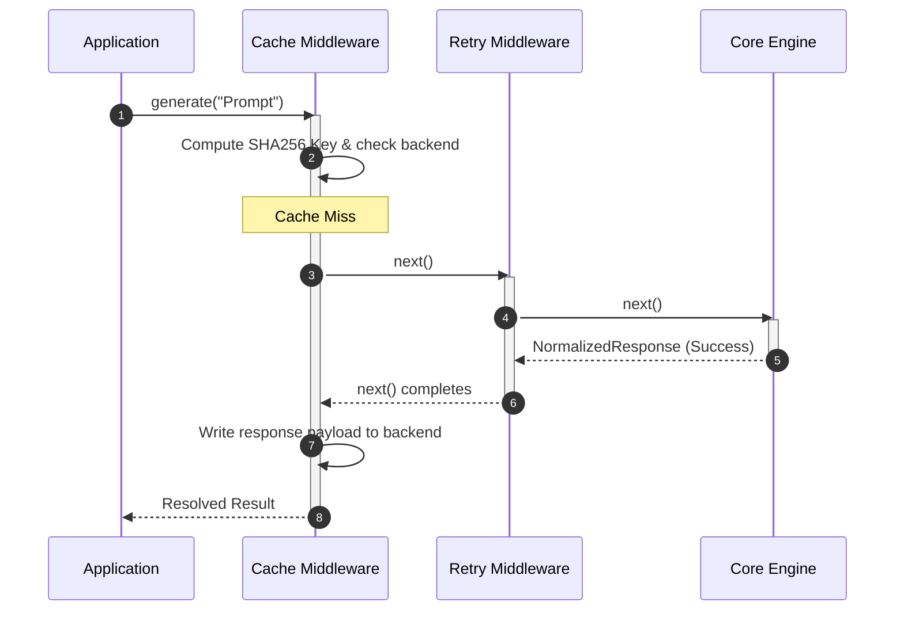
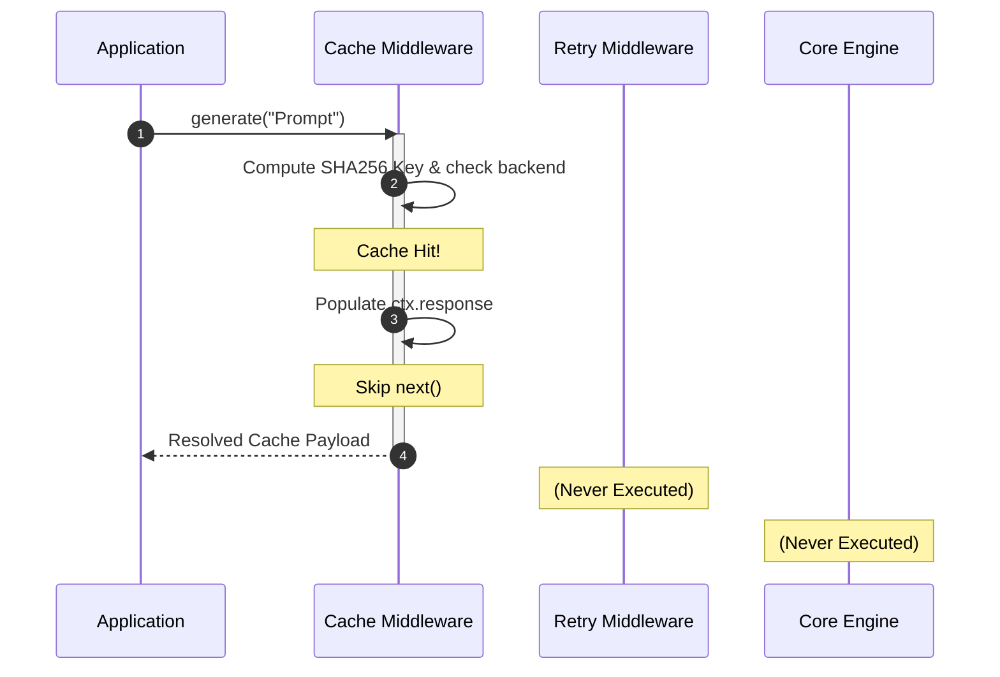

# D06 — Middleware Architecture RFC

| Field            | Value                                                                                                                                                                                                                                                                                                                                                                                                                                                                                                                |
| ---------------- | -------------------------------------------------------------------------------------------------------------------------------------------------------------------------------------------------------------------------------------------------------------------------------------------------------------------------------------------------------------------------------------------------------------------------------------------------------------------------------------------------------------------- |
| **Document ID**  | D06                                                                                                                                                                                                                                                                                                                                                                                                                                                                                                                  |
| **Title**        | Middleware Architecture RFC                                                                                                                                                                                                                                                                                                                                                                                                                                                                                          |
| **Status**       | Draft                                                                                                                                                                                                                                                                                                                                                                                                                                                                                                                |
| **Priority**     | P0 — Core Subsystem                                                                                                                                                                                                                                                                                                                                                                                                                                                                                                  |
| **Tier**         | Tier 2                                                                                                                                                                                                                                                                                                                                                                                                                                                                                                               |
| **Author**       | Lead Systems Architect                                                                                                                                                                                                                                                                                                                                                                                                                                                                                               |
| **Dependencies** | [D01 — Product Vision](file:///Users/adijain/Documents/Projects/vectrion/docs/architecture/D01-product-vision.md), [D02 — System Architecture Overview](file:///Users/adijain/Documents/Projects/vectrion/docs/architecture/D02-system-architecture-overview.md), [D03 — Monorepo Structure](file:///Users/adijain/Documents/Projects/vectrion/docs/architecture/D03-monorepo-structure.md), [D04 — Runtime Lifecycle](file:///Users/adijain/Documents/Projects/vectrion/docs/architecture/D04-runtime-lifecycle.md) |
| **Dependents**   | D07, D08 (and all custom middleware integrations)                                                                                                                                                                                                                                                                                                                                                                                                                                                                    |
| **Created**      | 2026-05-28                                                                                                                                                                                                                                                                                                                                                                                                                                                                                                           |
| **Last Updated** | 2026-05-28                                                                                                                                                                                                                                                                                                                                                                                                                                                                                                           |

---

## Table of Contents

1. [Purpose](#1-purpose)
2. [The Onion Middleware Pattern](#2-the-onion-middleware-pattern)
3. [The Middleware Interface Contract](#3-the-middleware-interface-contract)
4. [Standard Pre-Built Middleware Specifications](#4-standard-pre-built-middleware-specifications)
5. [Developing Custom Middleware](#5-developing-custom-middleware)
6. [Pipeline Sequencing Diagrams](#6-pipeline-sequencing-diagrams)
7. [Operational Performance & Safety Limits](#7-operational-performance--safety-limits)
8. [Glossary](#8-glossary)

---

## 1. Purpose

This Request for Comments (RFC) defines the architecture, contracts, behaviors, and specifications for Vectrion's **Middleware Subsystem**. Traditional AI SDKs rely on static configurations or observers (callbacks) that cannot mutate requests or control execution logic.

This specification establishes a composable, Onion-model execution pipeline that enables cross-cutting operational concerns — such as automated retries, failovers, caches, rate limits, and output verifications — to be implemented as isolated, reusable, and type-safe middleware modules.

---

## 2. The Onion Middleware Pattern

Vectrion uses an asynchronous **Onion execution pipeline**. Unlike linear callback lines, onion middleware executes in two distinct directions in a single request lifecycle:

1. **Pre-Execution (Inward Path)**: Middleware executes outer-to-inner, intercepting, inspecting, or mutating the request parameters _before_ they are dispatched to the routing and provider adapters.
2. **Post-Execution (Outward Path)**: Once the core model completes, execution yields backward inner-to-outer, allowing middleware to inspect responses, record latency, handle errors, or cache successful results.

```
       Inward (Request)                  Outward (Response)
   ───► [Middleware 0: Cache]             [Middleware 0: Cache] ───► Result
            │                                      ▲
            ▼                                      │
   ───► [Middleware 1: Retry]             [Middleware 1: Retry] ───► Yield
            │                                      ▲
            ▼                                      │
   ───► [Core: Route & Execute] ───────────────────┘
```

---

## 3. The Middleware Interface Contract

A middleware is a standard TypeScript function matching the async next-signature defined in `@vectrion/types`:

```typescript
export type NextFunction = () => Promise<void>;
export type Middleware = (ctx: RequestContext, next: NextFunction) => Promise<void>;
```

### 3.1 Contract Rules & Runtime Invariants

- **Next Invocation**: Middleware must invoke `await next()` exactly once to propagate execution to the next layer in the pipeline.
- **Short-Circuit Exception**: A middleware can deliberately skip invoking `next()`. In this scenario (e.g. Cache Hit), the execution loops halt immediately, and the pipeline winds backwards from the current layer.
- **Strict Context Mutation**: Middleware communicates exclusively by mutating properties inside `RequestContext` or appending values to the localized `ctx.metadata` storage bucket.

---

## 4. Standard Pre-Built Middleware Specifications

Vectrion bundles four core operational middleware engines:

### 4.1 Automated Retries: `retry(options)`

Gracefully intercept failures (such as rate limits or transient server drops) and retry execution automatically with configurable backoff algorithms.

#### 4.1.1 Configuration Schema

```typescript
interface RetryOptions {
    maxAttempts?: number; // Maximum number of retries (Default: 3)
    backoff?: 'exponential' | 'linear'; // Backoff strategy (Default: 'exponential')
    initialDelayMs?: number; // Initial delay duration (Default: 1000)
    maxDelayMs?: number; // Maximum cap on wait time (Default: 10000)
    jitter?: boolean; // Inject random noise to prevent thundering herds (Default: true)
}
```

#### 4.1.2 Execution Algorithm

If the downstream execution rejects with a `VectrionRateLimitError` or `VectrionServerDownError`, the retry engine catches the exception, computes the dynamic delay duration using the equation below, waits, and reinvokes `next()` up to `maxAttempts`:

$$\text{Delay} = \min\left(\text{maxDelayMs}, \text{initialDelayMs} \times 2^{\text{attempt}}\right) \times (1 + \text{Random Jitter})$$

---

### 4.2 Dynamic Caching: `cache(options)`

Caches successful output generations locally or in distributed backends to prevent redundant downstream model calls and eliminate API fees.

#### 4.2.1 Configuration Schema

```typescript
interface CacheOptions {
    backend: CacheBackend; // Memory or Redis storage connection
    ttlSeconds?: number; // Time-To-Live duration (Default: 300)
    excludeModels?: string[]; // Array of models to never cache
}

interface CacheBackend {
    get(key: string): Promise<string | null>;
    set(key: string, value: string, ttlSeconds?: number): Promise<void>;
}
```

#### 4.2.2 Cache Key Derivation

To prevent collision states, cache keys are derived deterministically by hashing the serialized values of the prompt parameters, temperature, maxTokens, and model signatures:

$$\text{Cache Key} = \text{SHA256}(\text{model} + \text{prompt} + \text{temperature} + \text{maxTokens} + \text{schema})$$

---

### 4.3 Cascade Failover: `fallback(options)`

Binds dynamic model routing failover paths inside the middleware pipeline, bypassing router logic if absolute provider isolation is needed.

#### 4.3.1 Configuration Schema

```typescript
interface FallbackOptions {
    cascade: string[]; // Array of secondary model/provider fallbacks
}
```

#### 4.3.2 Execution Algorithm

If the primary execution rejects, the fallback middleware intercepts the exception, updates the request model in `ctx.request.model` to the next candidate in the cascade chain, and restarts downstream traversal.

---

### 4.4 Proactive Rate Limiting: `rateLimiter(options)`

Prevents application crashes due to upstream rate limits by applying client-side request and token throttling using the Token Bucket algorithm.

#### 4.4.1 Configuration Schema

```typescript
interface RateLimiterOptions {
    tokensPerMinute: number; // Maximum allowed tokens in bucket
    throttleMode?: 'block' | 'throw'; // Block execution or throw VectrionRateLimitError (Default: 'block')
}
```

---

## 5. Developing Custom Middleware

Writing a custom middleware requires no inheritance or boilerplate. Below are three complete development patterns:

### 5.1 Pattern A: Execution Latency Logger

Measures and logs execution latency for every request:

```typescript
import { Middleware, RequestContext } from '@vectrion/types';

export function latencyLogger(): Middleware {
    return async (ctx: RequestContext, next) => {
        const startTime = Date.now();

        // Propagate down the onion pipeline
        await next();

        // Execute on the outward path
        const elapsed = Date.now() - startTime;
        console.log(
            `[Vectrion Audit] Request completed in ${elapsed}ms for model: ${ctx.request.model}`,
        );
    };
}
```

### 5.2 Pattern B: API Key Header Injector

Mutates metadata parameters on the inward path:

```typescript
export function apiKeyInjector(apiKey: string): Middleware {
    return async (ctx: RequestContext, next) => {
        // Inward Interception: inject credential to context metadata
        ctx.metadata.customAuthHeader = `Bearer ${apiKey}`;

        // Propagate downstream
        await next();
    };
}
```

---

## 6. Pipeline Sequencing Diagrams

### 6.1 Success Cycle with Active Middleware

A complete request-response traversal with retry and cache checks active:



### 6.2 Cache Hit Short-Circuit Sequence

When cache matches, the downstream retry checks and remote provider dispatches are skipped entirely:



---

## 7. Operational Performance & Safety Limits

### 7.1 Lifecycle Stack Size Cap

Because the pipeline uses recursive dispatch closures, there is a risk of Call Stack Overflow if too many middleware handlers are chained.

- **Safety Rule**: Vectrion enforces a hard pipeline ceiling of **32 middleware registrations** per client. Attempting to register more triggers a configuration throw at boot.

### 7.2 Core Overhead Budget

- **Performance Guarantee**: The internal CPU execution overhead introduced by the middleware runner dispatcher (excluding networking or schema validations) is budgeted to stay **under 0.2ms** per request on V8 platforms.

---

## 8. Glossary

- **Onion Model**: An asynchronous execution design pattern where requests flow sequentially through middleware layers, execute the core operation, and yield backwards in reverse order.
- **Short-Circuiting**: Halting downstream pipeline propagation (e.g., returning cached responses without invoking `next()`).
- **Jitter**: Random variations added to backoff delay timers to prevent thundering herds from hammering remote backends.
- **Token Bucket**: An algorithm used to manage rate limiting by storing and replenishing virtual tokens representing requests or throughput capacity.
- **Next Function**: The callback callback supplied to middleware to trigger execution of the next layer in the pipeline.
