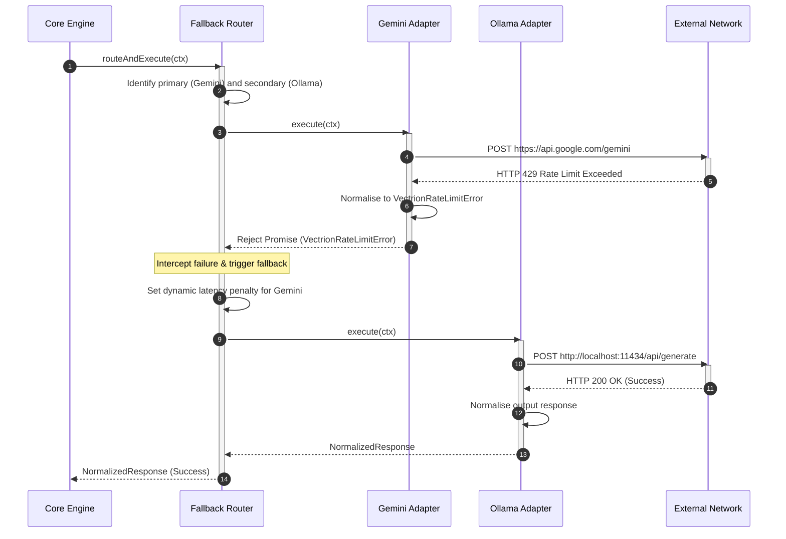

# D07 — Router Engine Specification

| Field            | Value                                                                                                                                                                                                                                                                                                                                                                                                                                                                                                                                                                                                                                              |
| ---------------- | -------------------------------------------------------------------------------------------------------------------------------------------------------------------------------------------------------------------------------------------------------------------------------------------------------------------------------------------------------------------------------------------------------------------------------------------------------------------------------------------------------------------------------------------------------------------------------------------------------------------------------------------------- |
| **Document ID**  | D07                                                                                                                                                                                                                                                                                                                                                                                                                                                                                                                                                                                                                                                |
| **Title**        | Router Engine Specification                                                                                                                                                                                                                                                                                                                                                                                                                                                                                                                                                                                                                        |
| **Status**       | Draft                                                                                                                                                                                                                                                                                                                                                                                                                                                                                                                                                                                                                                              |
| **Priority**     | P0 — Core Subsystem                                                                                                                                                                                                                                                                                                                                                                                                                                                                                                                                                                                                                                |
| **Tier**         | Tier 2                                                                                                                                                                                                                                                                                                                                                                                                                                                                                                                                                                                                                                             |
| **Author**       | Lead Systems Architect                                                                                                                                                                                                                                                                                                                                                                                                                                                                                                                                                                                                                             |
| **Dependencies** | [D01 — Product Vision](file:///Users/adijain/Documents/Projects/vectrion/docs/architecture/D01-product-vision.md), [D02 — System Architecture Overview](file:///Users/adijain/Documents/Projects/vectrion/docs/architecture/D02-system-architecture-overview.md), [D03 — Monorepo Structure](file:///Users/adijain/Documents/Projects/vectrion/docs/architecture/D03-monorepo-structure.md), [D04 — Runtime Lifecycle](file:///Users/adijain/Documents/Projects/vectrion/docs/architecture/D04-runtime-lifecycle.md), [D05 — Provider Adapter Design](file:///Users/adijain/Documents/Projects/vectrion/docs/architecture/D05-provider-adapter.md) |
| **Dependents**   | D08 (and all multi-provider client systems)                                                                                                                                                                                                                                                                                                                                                                                                                                                                                                                                                                                                        |
| **Created**      | 2026-05-28                                                                                                                                                                                                                                                                                                                                                                                                                                                                                                                                                                                                                                         |
| **Last Updated** | 2026-05-28                                                                                                                                                                                                                                                                                                                                                                                                                                                                                                                                                                                                                                         |

---

## Table of Contents

1. [Purpose](#1-purpose)
2. [The Router Abstraction Layer](#2-the-router-abstraction-layer)
3. [Pre-Built Routing Strategies](#3-pre-built-routing-strategies)
4. [Dynamic Latency Tracking & Weight Calculations](#4-dynamic-latency-tracking--weight-calculations)
5. [Automated Fallback & Failover Cascades](#5-automated-fallback--failover-cascades)
6. [Dynamic Load Balancing Algorithms](#6-dynamic-load-balancing-algorithms)
7. [Operational Cascading Diagrams](#7-operational-cascading-diagrams)
8. [Glossary](#8-glossary)

---

## 1. Purpose

This document specifies the architecture and implementation designs for the **Vectrion Router Engine**. Production AI applications require dynamic routing capabilities to navigate issues such as single-provider downtime, rate limiting ceilings, model pricing discrepancies, and geographical network latency.

This specification defines the strict routing interface (`RouterEngine`), dynamic latency metrics collection algorithms, cost-vs-performance balanced routing math, and automated fallback cascade sequences.

---

## 2. The Router Abstraction Layer

The router occupies the execution space between the middleware pipeline and the individual provider adapters. It accepts the active `RequestContext` and maps execution to the optimal candidate provider adapter:

```
[Middleware Pipeline] ──► [RouterEngine]
                                │
               ┌────────────────┼────────────────┐
               ▼                ▼                ▼
         Route Strategy:  Route Strategy:  Route Strategy:
           "Cheapest"       "Fastest"       "Fallback"
               │                │                │
               └────────────────┼────────────────┘
                                ▼
                       [Provider Adapter]
```

### 2.1 RouterEngine Interface Specification

Any custom routing component must implement the standard contract defined in `@vectrion/types`:

```typescript
export interface RouterEngine {
    // Routes and executes a request, handling failovers internally if necessary
    routeAndExecute(
        ctx: RequestContext,
        providers: Map<string, ProviderAdapter>,
        options?: { signal?: AbortSignal },
    ): Promise<NormalizedResponse>;
}
```

---

## 3. Pre-Built Routing Strategies

Vectrion provides four standard, out-of-the-box routing engines inside the `@vectrion/router` package:

### 3.1 Sequential Failover Router: `SimpleDefaultRouter`

Traces providers sequentially in registration order, returning the first successful execution.

- **Behavior**: If Provider A fails, it catches the error and immediately routes to Provider B.
- **Ideal for**: Simple local-fallback systems (e.g. Google Gemini with Ollama local fallback).

---

### 3.2 Dynamic Cost Router: `CheapestRouter`

Determines the most cost-effective provider adapter matching the requested model capabilities.

- **Behavior**: Scans capabilities to identify compatible adapters, calculates input + output pricing using the cost index (→ D05), and dispatches to the lowest-priced provider.
- **Ideal for**: Batch processes and non-interactive workflows.

---

### 3.3 Dynamic Performance Router: `FastestRouter`

Routes requests to the provider adapter displaying the lowest rolling average latency.

- **Behavior**: Tracks request durations to calculate a rolling average of response latency per provider, selecting the fastest node for new requests.
- **Ideal for**: Conversational interfaces and real-time interactive search.

---

### 3.4 Balanced Performance Router: `BalancedRouter`

Evaluates cost-vs-performance trade-offs based on weighted configuration preferences.

#### 3.4.1 Configuration Schema

```typescript
interface BalancedRouterOptions {
    weights: {
        cost: number; // Weight coefficient for cost [0.0 - 1.0]
        latency: number; // Weight coefficient for latency [0.0 - 1.0]
    };
}
```

#### 3.4.2 Routing Selection Score Formula

For each compatible provider, the router computes an optimization score. The node displaying the **lowest** score is selected:

$$\text{Score} = \left(\text{Normalized Cost} \times w_{\text{cost}}\right) + \left(\text{Normalized Latency} \times w_{\text{latency}}\right)$$

---

## 4. Dynamic Latency Tracking & Weight Calculations

To prevent static performance routing under shifting network conditions, Vectrion tracks latency dynamically.

### 4.1 Latency Aggregator Algorithm

The router maintains a sliding history buffer of execution times in memory:

- **Rolling Window Size**: The average is calculated over the last **10 successful requests** per provider.
- **Decay Rule**: Older latency data points decay exponentially to prioritize recent performance states.
- **Rate Limit Treatment**: If a provider returns a `VectrionRateLimitError` or throws a connection exception, its rolling latency average is temporarily penalized with a **5000ms latency penalty** to redirect traffic away from the congested node.

---

## 5. Automated Fallback & Failover Cascades

When an execution fails, the router manages recovery dynamically.

### 5.1 Fallback Cascade Rules

1. **Capability Assertion**: The router verifies that the fallback provider matches the feature requirements (e.g. Structured Outputs if a Zod schema is present). If not, it skips that candidate.
2. **Signal Preservation**: The original `AbortSignal` is propagated down the cascade chain to prevent lingering requests on fallback attempts if the user cancels mid-process.
3. **Exhaustion Exception**: If all candidate adapters fail or are excluded, the router throws a typed `VectrionRouterError` containing a trace of all attempted providers and their respective exceptions.

---

## 6. Dynamic Load Balancing Algorithms

When multiple identical adapters are available, the router load-balances traffic using three selectable algorithms:

| Load Balancing Algorithm | Mechanism                                                | Best Used For                                                         |
| :----------------------- | :------------------------------------------------------- | :-------------------------------------------------------------------- |
| **Round Robin**          | Sequentially alternates across adapters.                 | Equal load distribution across homogeneous servers.                   |
| **Random**               | Selects nodes using uniform pseudo-random distributions. | Decentralized systems with zero state tracking.                       |
| **Weighted Random**      | Selects nodes based on configured weight ratios.         | Combining heterogeneous hardware (e.g. local Ollama + remote Ollama). |

---

## 7. Operational Cascading Diagrams

### 7.1 Multi-Provider Fallback Cycle

The diagram below illustrates a successful fallback sequence after a primary provider failure:



---

## 8. Glossary

- **Router Engine**: The routing component responsible for selecting and executing the optimal provider adapter.
- **Failover**: The automated transition to a fallback provider when the primary provider encounters an error.
- **Rolling Average**: A calculation that averages data points from a moving sliding window of recent executions.
- **Load Balancing**: Distributing network requests across multiple equivalent compute nodes to prevent server overloads.
- **Dynamic Latency Penalty**: A temporary artificial latency increase applied to a provider in the routing table after it encounters a rate limit or server error.
