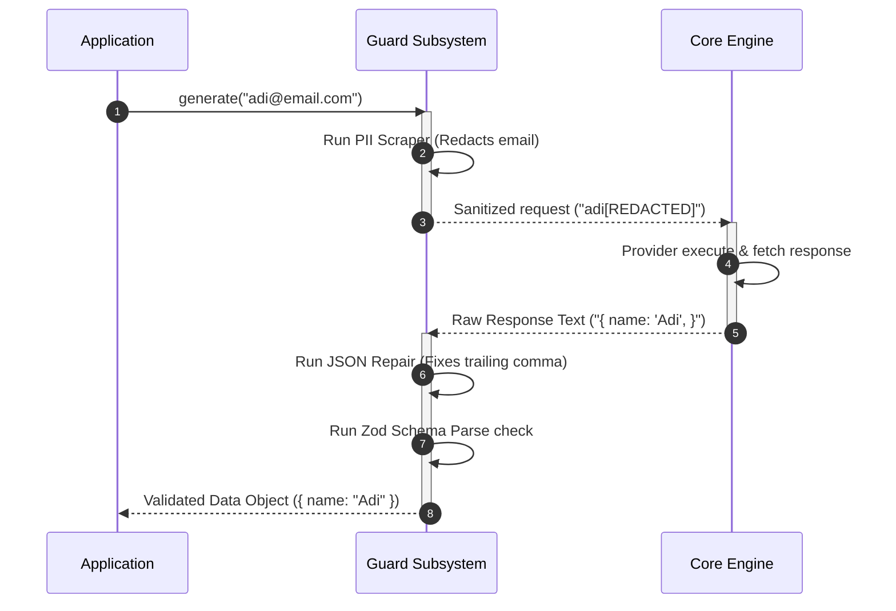

# D10 — Guardrails & Validation System Design

| Field            | Value                                                                                                                                                                                                                                                                                                                                                                                                                                                                                                                                                                                                                                     |
| ---------------- | ----------------------------------------------------------------------------------------------------------------------------------------------------------------------------------------------------------------------------------------------------------------------------------------------------------------------------------------------------------------------------------------------------------------------------------------------------------------------------------------------------------------------------------------------------------------------------------------------------------------------------------------- |
| **Document ID**  | D10                                                                                                                                                                                                                                                                                                                                                                                                                                                                                                                                                                                                                                       |
| **Title**        | Guardrails & Validation System Design                                                                                                                                                                                                                                                                                                                                                                                                                                                                                                                                                                                                     |
| **Status**       | Draft                                                                                                                                                                                                                                                                                                                                                                                                                                                                                                                                                                                                                                     |
| **Priority**     | P1 — System Safety & Reliability                                                                                                                                                                                                                                                                                                                                                                                                                                                                                                                                                                                                          |
| **Tier**         | Tier 2                                                                                                                                                                                                                                                                                                                                                                                                                                                                                                                                                                                                                                    |
| **Author**       | Lead Systems Architect                                                                                                                                                                                                                                                                                                                                                                                                                                                                                                                                                                                                                    |
| **Dependencies** | [D01 — Product Vision](file:///Users/adijain/Documents/Projects/vectrion/docs/architecture/D01-product-vision.md), [D02 — System Architecture Overview](file:///Users/adijain/Documents/Projects/vectrion/docs/architecture/D02-system-architecture-overview.md), [D03 — Monorepo Structure](file:///Users/adijain/Documents/Projects/vectrion/docs/architecture/D03-monorepo-structure.md), [D04 — Runtime Lifecycle](file:///Users/adijain/Documents/Projects/vectrion/docs/architecture/D04-runtime-lifecycle.md), [D08 — SDK API Surface](file:///Users/adijain/Documents/Projects/vectrion/docs/architecture/D08-sdk-api-surface.md) |
| **Dependents**   | D15, D19 (and all validation/security components)                                                                                                                                                                                                                                                                                                                                                                                                                                                                                                                                                                                         |
| **Created**      | 2026-05-28                                                                                                                                                                                                                                                                                                                                                                                                                                                                                                                                                                                                                                |
| **Last Updated** | 2026-05-28                                                                                                                                                                                                                                                                                                                                                                                                                                                                                                                                                                                                                                |

---

## Table of Contents

1. [Purpose](#1-purpose)
2. [Guardrail Subsystem Architecture](#2-guardrail-subsystem-architecture)
3. [Input Validation & PII Redaction](#3-input-validation--pii-redaction)
4. [Structured Output Extraction & JSON Repair](#4-structured-output-extraction--json-repair)
5. [Zod Schema Enforcement & Validation Rejections](#5-zod-schema-enforcement--validation-rejections)
6. [Semantic Content Filtering Policies](#6-semantic-content-filtering-policies)
7. [The Guardrail Execution Pipeline](#7-the-guardrail-execution-pipeline)
8. [Glossary](#8-glossary)

---

## 1. Purpose

This document establishes the architecture and design specifications for the **Guardrails & Validation Subsystem** (`@vectrion/guard`). Large Language Models are inherently probabilistic, meaning they can produce malformed JSON strings, bleed sensitive Private Identifiable Information (PII), bypass formatting requirements, or generate content violating safety guidelines.

This specification details input parameter sanitization, regex-based JSON extraction and repair pipelines, Zod compile-time enforcement, and safety content filtering mechanisms.

---

## 2. Guardrail Subsystem Overview

The `@vectrion/guard` package runs at two key checkpoints in the request lifecycle:

```
[Inward Path]  ──► [Input Validator]  ──► [PII Scraper]  ──► (Request Dispatched)
                                                                 │
                                                                 ▼
[Outward Path] ──◄ [Output Validator] ──◄ [JSON Repair] ──◄ (Response Received)
```

1. **Inward Checkpoint**: Cleans and verifies prompts and parameters _before_ they exit the local process boundary.
2. **Outward Checkpoint**: Extracts, repairs, and validates generation outputs _before_ yielding control back to application-level handlers.

---

## 3. Input Validation & PII Redaction

Input guardrails prevent data leakage by sanitizing user-supplied prompts before dispatching them to external cloud provider APIs.

### 3.1 PII Masking Engine

The input guardrail scans prompts against a compilation of regex filters to redact sensitive personal credentials:

```typescript
export interface PIIMaskConfig {
    redactTypes: ('email' | 'creditCard' | 'ssn' | 'ipAddress')[];
    placeholder?: string; // Character mask representation (Default: "[REDACTED]")
    customPatterns?: Array<{ name: string; pattern: RegExp }>;
}
```

### PII Regex Specifications:

- **Email**: `/[\w.-]+@[\w.-]+\.\w+/g`
- **Credit Card**: `/\b(?:\d[ -]*?){13,16}\b/g` (Luhn algorithm checked on matches)
- **SSN (US)**: `/\b\d{3}-\d{2}-\d{4}\b/g`

---

## 4. Structured Output Extraction & JSON Repair

Upstream providers occasionally wrap JSON returns inside markdown blocks (e.g. ` ```json ... ``` `) or append trailing comments, breaking native parsing.

### 4.1 JSON Extraction Flow

The extraction engine executes a three-tier recovery pipeline on response texts:

````
          [Raw Response Text]
                   │
                   ▼
       Is text a pure JSON object? ──── Yes ───► JSON.parse()
                   │
                  No
                   │
                   ▼
     Attempt Markdown block extraction
        (Regex: /```json\s*([\s\S]*?)\s*```/) ──► Found? ─── Yes ───► JSON.parse()
                   │
                  No
                   │
                   ▼
      Identify JSON Boundaries
      (First '{' to last '}') ───────────────── Found? ─── Yes ───► JSON.parse()
                   │
                  No
                   │
                   ▼
         Throw Parse Exception
````

### 4.2 Malformed JSON Repair

If `JSON.parse` fails, Vectrion applies localized syntax repairs:

- Replaces curly smart quotes (`“`, `”`) with standard straight double-quotes (`"`).
- Strips trailing commas before closing braces (`]`, `}`).
- Trims trailing spaces or stray non-JSON suffix fragments.

---

## 5. Zod Schema Enforcement & Validation Rejections

Once a JSON object is extracted and parsed, the guardrail performs type assertions against the client's configured `zod` schema.

### 5.1 Validation Error Structure

If validation fails, Vectrion blocks the pipeline, bypasses standard returns, and propagates a `VectrionValidationError` wrapping precise Zod issues:

```typescript
export class VectrionValidationError extends VectrionError {
    readonly issues: Array<{
        path: string[]; // JSON property key path to invalid element
        message: string; // Human-readable validation error description
        code: string; // Zod validation code reference (e.g. "invalid_type")
    }>;

    constructor(message: string, issues: z.ZodIssue[]);
}
```

---

## 6. Semantic Content Filtering Policies

Vectrion features safety policy guardrails to enforce user-configured content filtering criteria.

```typescript
export interface SafetyConfig {
    categories: {
        harassment: 'block' | 'allow';
        hateSpeech: 'block' | 'allow';
        sexuallyExplicit: 'block' | 'allow';
        dangerousContent: 'block' | 'allow';
    };
    threshold: 'low' | 'medium' | 'high'; // Safety confidence threshold
}
```

---

## 7. The Guardrail Execution Pipeline

To create custom validation guardrails, developers can implement the structural interfaces defined in `@vectrion/guard`:

```typescript
export interface InputGuardrail {
    readonly id: string;
    validateInput(prompt: string, ctx: RequestContext): Promise<string> | string;
}

export interface OutputGuardrail {
    readonly id: string;
    validateOutput(text: string, ctx: RequestContext): Promise<string> | string;
}
```

### 7.1 Multi-Stage Verification Sequence

The sequence below illustrates the execution pattern when both input and output guardrails are active:



---

## 8. Glossary

- **PII Redaction**: Scanning and replacing personal information (such as credit card numbers or email addresses) with generic placeholders.
- **JSON Repair**: The process of fixing syntax errors (like mismatched quotes or trailing commas) in generated strings to allow successful JSON parsing.
- **Luhn Algorithm**: A checksum formula used to validate card numbers against input typos.
- **Markdown Block**: Code formatting notation used in markdown files, e.g., surrounding text inside backtick sequences.
- **Safety Threshold**: The confidence level used to trigger warnings or block generations under safety guidelines.
