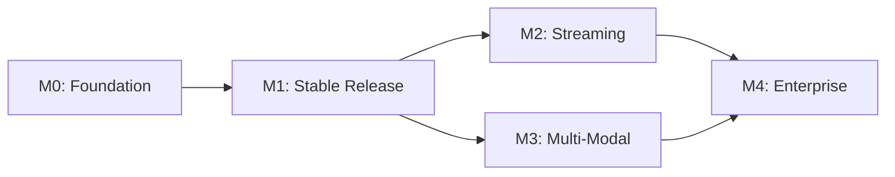

# D24 — Roadmap: Phased Delivery Plan

| Field            | Value                                                                                                                                         |
| ---------------- | --------------------------------------------------------------------------------------------------------------------------------------------- |
| **Document ID**  | D24                                                                                                                                           |
| **Title**        | Roadmap — Phased Delivery Plan                                                                                                                |
| **Tier**         | Tier 4 — Governance & Roadmap                                                                                                                 |
| **Priority**     | P3                                                                                                                                            |
| **Status**       | Draft                                                                                                                                         |
| **Dependencies** | D01, D02, D23                                                                                                                                  |
| **Audience**     | Core Team, Contributors, Community, Stakeholders                                                                                              |
| **Last Updated** | 2026-05-28                                                                                                                                    |

---

## 1. Executive Summary

This document defines the phased delivery plan for the Vectrion SDK, organized into milestones with clear deliverables, acceptance criteria, and dependencies. Each milestone builds upon the previous one and can be shipped independently.

---

## 2. Milestone Overview

```
┌──────────┐    ┌──────────┐    ┌──────────┐    ┌──────────┐    ┌──────────┐
│  M0      │───▶│  M1      │───▶│  M2      │───▶│  M3      │───▶│  M4      │
│ Foundation│    │ Stable   │    │ Streaming│    │ Multi-   │    │Enterprise│
│ (Current) │    │ Release  │    │ Support  │    │ Modal    │    │ Features │
│ v0.1.x   │    │ v1.0.0   │    │ v1.x     │    │ v2.0     │    │ v3.0     │
└──────────┘    └──────────┘    └──────────┘    └──────────┘    └──────────┘
```

---

## 3. Milestone 0: Foundation (Current)

**Version**: `0.1.x`  
**Status**: ✅ In Progress  
**Target**: Complete

### Deliverables

| # | Deliverable | Status |
| - | ----------- | ------ |
| 1 | Monorepo scaffolding (pnpm + Turborepo) | ✅ Done |
| 2 | `@vectrion/types` — Core type definitions | ✅ Done |
| 3 | `@vectrion/shared` — Error hierarchy, utilities | ✅ Done |
| 4 | `@vectrion/core` — Client, middleware runner | ✅ Done |
| 5 | `@vectrion/router` — Routing engine (cheapest, fastest, fallback) | ✅ Done |
| 6 | `@vectrion/guard` — Prompt injection guard | ✅ Done |
| 7 | `@vectrion/observe` — JSONL observability middleware | ✅ Done |
| 8 | `@vectrion/provider-google` — Google AI adapter | ✅ Done |
| 9 | `@vectrion/provider-ollama` — Ollama local adapter | ✅ Done |
| 10 | Playground integration demo | ✅ Done |
| 11 | Architecture documentation (D01–D25) | ✅ Done |
| 12 | Documentation website | ✅ Done |
| 13 | Unit + integration test suite | ✅ Done |

### Acceptance Criteria
- [x] All packages build (ESM + CJS + DTS)
- [x] All tests pass (7/7)
- [x] TypeScript typecheck passes (8/8 packages)
- [x] Playground executes 3 workflows successfully
- [x] Docs site renders all available documents

---

## 4. Milestone 1: Stable Release

**Version**: `1.0.0`  
**Status**: 📋 Planned  
**Target**: Q3 2026

### Deliverables

| # | Deliverable | Priority |
| - | ----------- | -------- |
| 1 | API surface freeze — no breaking changes after this point | P0 |
| 2 | Complete test coverage (>80% statements across all packages) | P0 |
| 3 | ESLint + Prettier configuration fully operational | P1 |
| 4 | `publint` validation for all package exports | P1 |
| 5 | CI/CD pipeline (GitHub Actions) | P1 |
| 6 | npm publish workflow with provenance | P1 |
| 7 | README.md for each package with usage examples | P2 |
| 8 | Getting Started guide in docs site | P2 |
| 9 | Changelog automation (conventional commits) | P2 |
| 10 | `@vectrion/provider-openai` adapter | P2 |

### Acceptance Criteria
- [ ] All packages published to npm with correct exports
- [ ] CI pipeline runs on every PR (build + test + typecheck + lint)
- [ ] API surface documented with JSDoc on every public export
- [ ] No `any` types in public API signatures
- [ ] Migration guide template established

---

## 5. Milestone 2: Streaming Support

**Version**: `1.x`  
**Status**: 📋 Planned  
**Target**: Q4 2026

### Deliverables

| # | Deliverable | Priority |
| - | ----------- | -------- |
| 1 | `generateStream()` API on `Vectrion` client | P0 |
| 2 | `AsyncGenerator<StreamChunk>` return type | P0 |
| 3 | `executeStream()` optional method on `ProviderAdapter` | P0 |
| 4 | Streaming middleware hooks (per-chunk processing) | P1 |
| 5 | Google provider streaming implementation | P1 |
| 6 | Ollama provider streaming implementation | P1 |
| 7 | Stream-to-string utility helper | P2 |
| 8 | Streaming observability traces | P2 |

---

## 6. Milestone 3: Multi-Modal & Agents

**Version**: `2.0`  
**Status**: 📋 Planned  
**Target**: Q1 2027

### Deliverables

| # | Deliverable | Priority |
| - | ----------- | -------- |
| 1 | Multi-modal `content` field on `GenerateRequest` | P0 |
| 2 | Image, audio, video input support | P0 |
| 3 | Tool/function calling interface | P1 |
| 4 | `createAgent()` API for agentic loops | P1 |
| 5 | Conversation context / session management | P1 |
| 6 | `@vectrion/provider-anthropic` adapter | P2 |
| 7 | Multi-turn middleware hooks | P2 |

---

## 7. Milestone 4: Enterprise Features

**Version**: `3.0`  
**Status**: 📋 Planned  
**Target**: Q3 2027

### Deliverables

| # | Deliverable | Priority |
| - | ----------- | -------- |
| 1 | `@vectrion/cache` — Semantic + exact caching | P1 |
| 2 | `@vectrion/ratelimit` — Per-provider rate limiting | P1 |
| 3 | `@vectrion/retry` — Retry with exponential backoff | P1 |
| 4 | OpenTelemetry trace export | P1 |
| 5 | A/B testing for provider selection | P2 |
| 6 | Enterprise audit logging | P2 |
| 7 | Multi-region provider routing | P2 |

---

## 8. Dependency Graph



---

## 9. References

| Reference | Link |
| --------- | ---- |
| D01 — Product Vision | Internal |
| D02 — System Architecture | Internal |
| D23 — Future Scalability | Internal |
