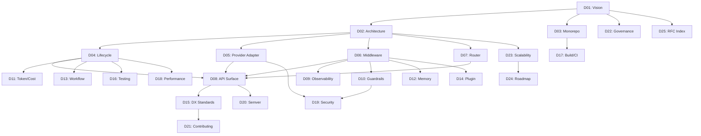

# D25 — Package-Level RFC Index

| Field            | Value                                                                                                                                         |
| ---------------- | --------------------------------------------------------------------------------------------------------------------------------------------- |
| **Document ID**  | D25                                                                                                                                           |
| **Title**        | Package-Level RFC Index                                                                                                                       |
| **Tier**         | Tier 4 — Governance & Roadmap                                                                                                                 |
| **Priority**     | P3                                                                                                                                            |
| **Status**       | Draft                                                                                                                                         |
| **Dependencies** | D01–D24                                                                                                                                        |
| **Audience**     | All Contributors, Maintainers                                                                                                                 |
| **Last Updated** | 2026-05-28                                                                                                                                    |

---

## 1. Executive Summary

This document serves as the master index of all Vectrion architecture documents, RFCs, and specifications. It maps each document to its relevant packages, provides a quick-reference for finding design rationale, and tracks the overall documentation completeness.

---

## 2. Document Index

### 2.1 Full Document Registry

| ID   | Title                                     | Tier | Status | Priority | Primary Packages                |
| ---- | ----------------------------------------- | ---- | ------ | -------- | ------------------------------- |
| D01  | Product Vision & Infrastructure Philosophy | T0   | Draft  | P0       | All                             |
| D02  | System Architecture Overview               | T0   | Draft  | P0       | All                             |
| D03  | Monorepo Structure & Package Boundaries    | T0   | Draft  | P0       | All                             |
| D04  | Runtime Lifecycle Specification            | T1   | Draft  | P1       | `core`                          |
| D05  | Provider Adapter System Design             | T1   | Draft  | P1       | `types`, `provider-*`           |
| D06  | Middleware Architecture RFC                | T1   | Draft  | P1       | `core`, `types`                 |
| D07  | Router Engine Specification                | T1   | Draft  | P1       | `router`                        |
| D08  | SDK API Surface Specification              | T1   | Draft  | P1       | `core`, `types`                 |
| D09  | Observability Pipeline Design              | T2   | Draft  | P2       | `observe`                       |
| D10  | Guardrails & Validation System Design      | T2   | Draft  | P2       | `guard`                         |
| D11  | Token & Cost Tracking System               | T2   | Draft  | P2       | `types`, `core`, `observe`      |
| D12  | Memory System Design                       | T2   | Draft  | P2       | `core` (future: `memory`)       |
| D13  | Workflow Orchestration Design              | T2   | Draft  | P2       | `core` (future: `workflow`)     |
| D14  | Plugin & Extensibility System Design       | T2   | Draft  | P2       | `core` (future: `plugin`)       |
| D15  | Developer Experience Standards             | T3   | Draft  | P3       | All                             |
| D16  | Testing Strategy & Quality Architecture    | T3   | Draft  | P3       | All                             |
| D17  | Build, Release & CI/CD Architecture        | T3   | Draft  | P3       | All                             |
| D18  | Performance Strategy & Budgets             | T3   | Draft  | P3       | `core`, `router`                |
| D19  | Security Philosophy & Threat Model         | T3   | Draft  | P3       | `guard`, `core`, `provider-*`   |
| D20  | Semantic Versioning & API Stability        | T3   | Draft  | P3       | All                             |
| D21  | Contribution Guidelines                    | T4   | Draft  | P3       | All                             |
| D22  | Open Source Governance Model               | T4   | Draft  | P3       | All                             |
| D23  | Future Scalability & Platform Evolution    | T4   | Draft  | P3       | All                             |
| D24  | Roadmap — Phased Delivery Plan             | T4   | Draft  | P3       | All                             |
| D25  | Package-Level RFC Index (this document)    | T4   | Draft  | P3       | All                             |

---

## 3. Package → Document Mapping

This reverse-index maps each package to its relevant design documents:

### 3.1 `@vectrion/core`

| Relevance | Documents |
| --------- | --------- |
| Primary   | D04 (Lifecycle), D06 (Middleware), D08 (API Surface) |
| Secondary | D01 (Vision), D02 (Architecture), D11 (Token Tracking), D18 (Performance) |
| Future    | D12 (Memory), D13 (Workflow), D14 (Plugin) |

### 3.2 `@vectrion/types`

| Relevance | Documents |
| --------- | --------- |
| Primary   | D05 (Provider Adapter), D06 (Middleware), D08 (API Surface) |
| Secondary | D01 (Vision), D02 (Architecture), D11 (Token Tracking) |

### 3.3 `@vectrion/shared`

| Relevance | Documents |
| --------- | --------- |
| Primary   | D03 (Monorepo Structure) |
| Secondary | D15 (Developer Experience), D19 (Security) |

### 3.4 `@vectrion/router`

| Relevance | Documents |
| --------- | --------- |
| Primary   | D07 (Router Engine) |
| Secondary | D02 (Architecture), D18 (Performance) |

### 3.5 `@vectrion/guard`

| Relevance | Documents |
| --------- | --------- |
| Primary   | D10 (Guardrails & Validation) |
| Secondary | D19 (Security), D06 (Middleware) |

### 3.6 `@vectrion/observe`

| Relevance | Documents |
| --------- | --------- |
| Primary   | D09 (Observability Pipeline) |
| Secondary | D11 (Token & Cost Tracking), D06 (Middleware) |

### 3.7 `@vectrion/provider-google`

| Relevance | Documents |
| --------- | --------- |
| Primary   | D05 (Provider Adapter System) |
| Secondary | D04 (Lifecycle), D19 (Security) |

### 3.8 `@vectrion/provider-ollama`

| Relevance | Documents |
| --------- | --------- |
| Primary   | D05 (Provider Adapter System) |
| Secondary | D04 (Lifecycle), D19 (Security) |

---

## 4. Documentation Dependency Graph

---

## 5. Documentation Completeness Metrics

| Tier                          | Total | Draft | Complete | Planned | Coverage |
| ----------------------------- | ----- | ----- | -------- | ------- | -------- |
| Tier 0 — Foundation           | 3     | 3     | 0        | 0       | 100%     |
| Tier 1 — Core Architecture    | 5     | 5     | 0        | 0       | 100%     |
| Tier 2 — Subsystem Design     | 6     | 6     | 0        | 0       | 100%     |
| Tier 3 — Engineering Standards | 6     | 6     | 0        | 0       | 100%     |
| Tier 4 — Governance & Roadmap | 5     | 5     | 0        | 0       | 100%     |
| **Total**                     | **25**| **25**| **0**    | **0**   | **100%** |

> [!TIP]
> All 25 documents have been authored in draft form. The next phase is to review each document for technical accuracy, add code examples from the current implementation, and promote them to "Complete" status.

---

## 6. References

| Reference | Link |
| --------- | ---- |
| D01–D24 | Internal (see table above) |
| Documentation Website | `apps/docs/` |
| Architecture Docs Directory | `docs/architecture/` |
